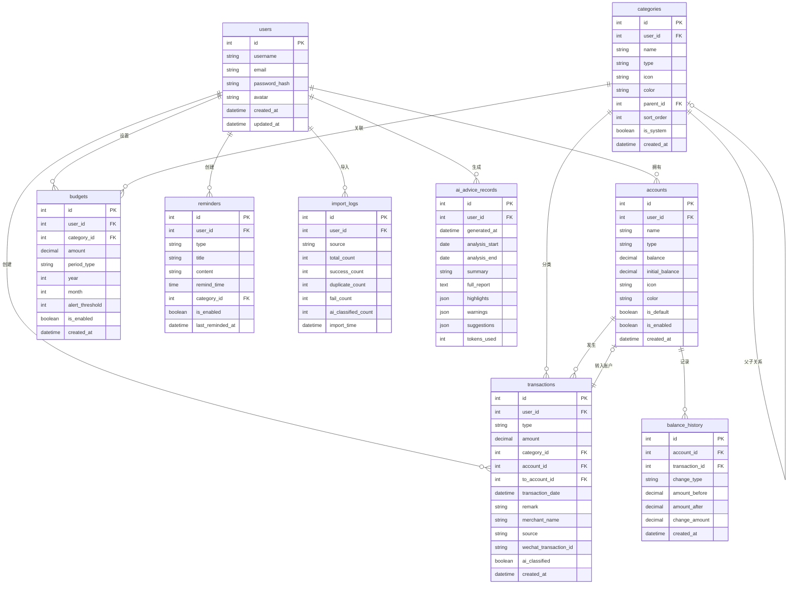

# 智能个人财务记账系统 - 架构设计文档

## 目录

- [1. 系统概述](#1-系统概述)
- [2. 整体架构](#2-整体架构)
- [3. 前端架构](#3-前端架构)
- [4. 后端架构](#4-后端架构)
- [5. 数据库设计](#5-数据库设计)
- [6. 系统交互流程](#6-系统交互流程)
- [7. 技术选型](#7-技术选型)
- [8. 安全架构](#8-安全架构)

---

## 1. 系统概述

### 1.1 系统定位

智能个人财务记账系统是一个面向个人用户的财务管理平台，提供日常收支记录、预算管理、数据统计和 AI 智能理财建议等核心功能。

### 1.2 核心特性

- **多账户管理**：支持现金、银行卡、微信、支付宝等多种账户类型
- **智能分类**：基于规则库 + LLM 的账单智能分类
- **微信账单导入**：支持 CSV/XLSX 格式的微信账单批量导入
- **预算监控**：月度/年度预算设置与实时预警
- **数据可视化**：多维度的收支统计与图表展示
- **AI 理财建议**：基于消费数据的个性化理财建议生成

### 1.3 设计原则

- **前后端分离**：前端 Vue 3 + 后端 FastAPI，通过 RESTful API 通信
- **模块化设计**：高内聚低耦合，便于扩展和维护
- **安全性优先**：JWT 认证 + 密码加密 + SQL 注入防护
- **用户体验**：响应式设计，支持移动端和桌面端

---

## 2. 整体架构

### 2.1 系统架构图

```
┌─────────────────────────────────────────────────────────────────────────────┐
│                              客户端层 (Client Layer)                          │
├─────────────────────────────────────────────────────────────────────────────┤
│  ┌─────────────────┐  ┌─────────────────┐  ┌─────────────────┐              │
│  │   Web Browser   │  │   Mobile Web    │  │   (Future App)  │              │
│  │   (Desktop)     │  │   (Responsive)  │  │                 │              │
│  └────────┬────────┘  └────────┬────────┘  └────────┬────────┘              │
│           │                    │                    │                        │
│           └────────────────────┼────────────────────┘                        │
│                                │                                             │
│                                ▼                                             │
│  ┌──────────────────────────────────────────────────────────────────────┐   │
│  │                     前端应用 (Vue 3 + TypeScript)                      │   │
│  │  ┌────────────┐ ┌────────────┐ ┌────────────┐ ┌────────────┐         │   │
│  │  │   Views    │ │ Components │ │   Stores   │ │   Utils    │         │   │
│  │  └────────────┘ └────────────┘ └────────────┘ └────────────┘         │   │
│  └──────────────────────────────────────────────────────────────────────┘   │
└─────────────────────────────────────────────────────────────────────────────┘
                                      │
                                      │ HTTP/HTTPS (RESTful API)
                                      ▼
┌─────────────────────────────────────────────────────────────────────────────┐
│                              服务端层 (Server Layer)                          │
├─────────────────────────────────────────────────────────────────────────────┤
│  ┌──────────────────────────────────────────────────────────────────────┐   │
│  │                        API Gateway (FastAPI)                          │   │
│  │  ┌────────────┐ ┌────────────┐ ┌────────────┐ ┌────────────┐         │   │
│  │  │   Auth     │ │    CORS    │ │  RateLimit │ │  Logging   │         │   │
│  │  │ Middleware │ │ Middleware │ │ Middleware │ │ Middleware │         │   │
│  │  └────────────┘ └────────────┘ └────────────┘ └────────────┘         │   │
│  └──────────────────────────────────────────────────────────────────────┘   │
│                                      │                                       │
│                                      ▼                                       │
│  ┌──────────────────────────────────────────────────────────────────────┐   │
│  │                        业务逻辑层 (Service Layer)                      │   │
│  │  ┌────────────┐ ┌────────────┐ ┌────────────┐ ┌────────────┐         │   │
│  │  │Auth Service│ │Trans Service│ │Budget Svc │ │ AI Service │         │   │
│  │  └────────────┘ └────────────┘ └────────────┘ └────────────┘         │   │
│  │  ┌────────────┐ ┌────────────┐ ┌────────────┐ ┌────────────┐         │   │
│  │  │Account Svc │ │Category Svc│ │Stats Service│ │Wechat Svc │         │   │
│  │  └────────────┘ └────────────┘ └────────────┘ └────────────┘         │   │
│  └──────────────────────────────────────────────────────────────────────┘   │
└─────────────────────────────────────────────────────────────────────────────┘
                                      │
                    ┌─────────────────┼─────────────────┐
                    │                 │                 │
                    ▼                 ▼                 ▼
┌───────────────────────────┐ ┌───────────────┐ ┌───────────────────────────┐
│      数据存储层 (Data)      │ │   缓存层       │ │      外部服务层            │
├───────────────────────────┤ ├───────────────┤ ├───────────────────────────┤
│  ┌─────────────────────┐  │ │ ┌───────────┐ │ │  ┌─────────────────────┐  │
│  │   MySQL 8.0         │  │ │ │  Redis    │ │ │  │  DeepSeek API       │  │
│  │   - 用户数据         │  │ │ │  - Cache  │ │ │  │  (智能分类/建议)     │  │
│  │   - 交易记录         │  │ │ │  - JWT    │ │ │  └─────────────────────┘  │
│  │   - 预算数据         │  │ │ │  - Session│ │ │  ┌─────────────────────┐  │
│  └─────────────────────┘  │ │ └───────────┘ │ │  │  OpenAI API         │  │
│  ┌─────────────────────┐  │ │               │ │  │  (备选 LLM)          │  │
│  │   Alembic 迁移       │  │ │               │ │  └─────────────────────┘  │
│  └─────────────────────┘  │ │               │ │                           │
└───────────────────────────┘ └───────────────┘ └───────────────────────────┘
```

### 2.2 技术栈总览

| 层级 | 技术选型 | 说明 |
|------|----------|------|
| 前端框架 | Vue 3 + TypeScript | 响应式框架，组合式 API |
| 前端构建 | Vite | 快速开发与构建 |
| 状态管理 | Pinia | 新一代状态管理 |
| UI 组件库 | Element Plus + Vant | 桌面端 + 移动端 |
| HTTP 客户端 | Axios | 请求封装与拦截 |
| 图表库 | ECharts | 数据可视化 |
| 后端框架 | FastAPI | 高性能异步框架 |
| ORM | SQLAlchemy 2.0 | 数据库操作 |
| 数据库 | MySQL 8.0 | 主数据存储 |
| 缓存 | Redis 7.x | 缓存与 Token 管理 |
| 认证 | JWT | 无状态认证 |

---

## 3. 前端架构

### 3.1 目录结构

```
frontend/
├── index.html                       # 应用入口 HTML
├── package.json                     # 项目依赖配置
├── tsconfig.json                    # TypeScript 配置
├── vite.config.ts                   # Vite 构建配置
├── public/                          # 静态资源目录
│
└── src/
    ├── main.ts                      # 应用入口文件
    ├── App.vue                      # 根组件
    ├── env.d.ts                     # 类型声明文件
    │
    ├── api/                         # API 接口封装层
    │   ├── index.ts                 # API 统一导出
    │   ├── request.ts               # Axios 实例与拦截器
    │   ├── auth.ts                  # 认证相关接口
    │   ├── transaction.ts           # 交易记录接口
    │   ├── account.ts               # 账户管理接口
    │   ├── category.ts              # 分类管理接口
    │   ├── budget.ts                # 预算管理接口
    │   ├── statistics.ts            # 统计分析接口
    │   ├── wechat.ts                # 微信账单导入接口
    │   └── ai.ts                    # AI 智能服务接口
    │
    ├── components/                  # 公共组件
    │   ├── common/                  # 通用基础组件
    │   │   ├── AppHeader.vue        # 顶部导航栏
    │   │   ├── AppSidebar.vue       # 侧边栏导航
    │   │   ├── AppFooter.vue        # 页脚
    │   │   ├── LoadingSpinner.vue   # 加载动画
    │   │   ├── EmptyState.vue       # 空状态占位
    │   │   └── ConfirmDialog.vue    # 确认弹窗
    │   │
    │   ├── business/                # 业务组件
    │   │   ├── TransactionCard.vue  # 交易记录卡片
    │   │   ├── CategoryIcon.vue     # 分类图标
    │   │   ├── AccountSelector.vue  # 账户选择器
    │   │   ├── AmountInput.vue      # 金额输入框
    │   │   ├── DatePicker.vue       # 日期选择器
    │   │   ├── BudgetProgress.vue   # 预算进度条
    │   │   ├── TrendChart.vue       # 趋势图表
    │   │   ├── CategoryPieChart.vue # 分类饼图
    │   │   └── FileUploader.vue     # 文件上传组件
    │   │
    │   └── layout/                  # 布局组件
    │       ├── MainLayout.vue       # 主布局（含侧边栏）
    │       ├── AuthLayout.vue       # 认证页面布局
    │       └── BlankLayout.vue      # 空白布局
    │
    ├── views/                       # 页面视图
    │   ├── auth/                    # 认证模块
    │   │   ├── LoginView.vue        # 登录页
    │   │   ├── RegisterView.vue     # 注册页
    │   │   └── ForgotPassword.vue   # 忘记密码
    │   │
    │   ├── dashboard/               # 仪表盘
    │   │   └── DashboardView.vue    # 首页概览
    │   │
    │   ├── transaction/             # 交易管理
    │   │   ├── TransactionList.vue  # 交易列表
    │   │   ├── TransactionAdd.vue   # 添加交易
    │   │   └── TransactionDetail.vue# 交易详情
    │   │
    │   ├── account/                 # 账户管理
    │   │   ├── AccountList.vue      # 账户列表
    │   │   └── AccountDetail.vue    # 账户详情
    │   │
    │   ├── statistics/              # 统计分析
    │   │   └── StatisticsView.vue   # 统计页面
    │   │
    │   ├── budget/                  # 预算管理
    │   │   └── BudgetView.vue       # 预算页面
    │   │
    │   ├── import/                  # 账单导入
    │   │   └── WechatImport.vue     # 微信账单导入
    │   │
    │   └── settings/                # 设置中心
    │       ├── SettingsView.vue     # 设置主页
    │       ├── ProfileView.vue      # 个人资料
    │       └── CategoryManage.vue   # 分类管理
    │
    ├── router/                      # 路由配置
    │   ├── index.ts                 # 路由主文件
    │   └── guards.ts                # 路由守卫
    │
    ├── stores/                      # Pinia 状态管理
    │   ├── index.ts                 # Store 统一导出
    │   ├── user.ts                  # 用户状态
    │   ├── account.ts               # 账户状态
    │   ├── category.ts              # 分类状态
    │   └── app.ts                   # 应用全局状态
    │
    ├── composables/                 # 组合式函数
    │   ├── useAuth.ts               # 认证逻辑
    │   ├── useTransaction.ts        # 交易逻辑
    │   ├── useStatistics.ts         # 统计逻辑
    │   └── useNotification.ts       # 通知逻辑
    │
    ├── utils/                       # 工具函数
    │   ├── format.ts                # 格式化工具
    │   ├── date.ts                  # 日期处理
    │   ├── storage.ts               # 本地存储
    │   ├── validator.ts             # 表单验证
    │   └── constants.ts             # 常量定义
    │
    ├── types/                       # TypeScript 类型定义
    │   ├── api.ts                   # API 响应类型
    │   ├── user.ts                  # 用户类型
    │   ├── transaction.ts           # 交易类型
    │   ├── account.ts               # 账户类型
    │   └── category.ts              # 分类类型
    │
    └── styles/                      # 全局样式
        ├── variables.scss           # CSS 变量
        ├── reset.scss               # 样式重置
        ├── common.scss              # 公共样式
        └── transitions.scss         # 过渡动画
```

### 3.2 页面组件结构图

```
┌─────────────────────────────────────────────────────────────────────────────┐
│                              App.vue                                         │
│  ┌───────────────────────────────────────────────────────────────────────┐  │
│  │                         Router View                                    │  │
│  │  ┌─────────────────────────────────────────────────────────────────┐  │  │
│  │  │                      MainLayout                                  │  │  │
│  │  │  ┌────────────┐  ┌────────────────────────────────────────────┐  │  │  │
│  │  │  │  Sidebar   │  │                Main Content                 │  │  │  │
│  │  │  │  ────────  │  │  ┌──────────────────────────────────────┐  │  │  │  │
│  │  │  │  📊 仪表盘 │  │  │  │           Header Breadcrumb         │  │  │  │  │
│  │  │  │  💰 交易   │  │  │  └──────────────────────────────────────┘  │  │  │  │
│  │  │  │  📈 统计   │  │  │  ┌──────────────────────────────────────┐  │  │  │  │
│  │  │  │  🎯 预算   │  │  │  │                                      │  │  │  │  │
│  │  │  │  🏦 账户   │  │  │  │           Page Content               │  │  │  │  │
│  │  │  │  📥 导入   │  │  │  │                                      │  │  │  │  │
│  │  │  │  ⚙️ 设置   │  │  │  │                                      │  │  │  │  │
│  │  │  │            │  │  │  └──────────────────────────────────────┘  │  │  │  │
│  │  │  └────────────┘  └────────────────────────────────────────────┘  │  │  │
│  │  └─────────────────────────────────────────────────────────────────┘  │  │
│  └───────────────────────────────────────────────────────────────────────┘  │
└─────────────────────────────────────────────────────────────────────────────┘
```

### 3.3 路由配置

```typescript
// router/index.ts
const routes: RouteRecordRaw[] = [
  // 认证路由（无侧边栏）
  {
    path: '/auth',
    component: () => import('@/layouts/AuthLayout.vue'),
    children: [
      { path: 'login', name: 'Login', component: () => import('@/views/auth/LoginView.vue') },
      { path: 'register', name: 'Register', component: () => import('@/views/auth/RegisterView.vue') },
      { path: 'forgot-password', name: 'ForgotPassword', component: () => import('@/views/auth/ForgotPassword.vue') },
    ],
  },

  // 主应用路由（含侧边栏）
  {
    path: '/',
    component: () => import('@/layouts/MainLayout.vue'),
    meta: { requiresAuth: true },
    children: [
      { path: '', redirect: '/dashboard' },
      { path: 'dashboard', name: 'Dashboard', component: () => import('@/views/dashboard/DashboardView.vue') },
      { path: 'transactions', name: 'TransactionList', component: () => import('@/views/transaction/TransactionList.vue') },
      { path: 'transactions/add', name: 'TransactionAdd', component: () => import('@/views/transaction/TransactionAdd.vue') },
      { path: 'transactions/:id', name: 'TransactionDetail', component: () => import('@/views/transaction/TransactionDetail.vue') },
      { path: 'accounts', name: 'AccountList', component: () => import('@/views/account/AccountList.vue') },
      { path: 'accounts/:id', name: 'AccountDetail', component: () => import('@/views/account/AccountDetail.vue') },
      { path: 'statistics', name: 'Statistics', component: () => import('@/views/statistics/StatisticsView.vue') },
      { path: 'budgets', name: 'Budgets', component: () => import('@/views/budget/BudgetView.vue') },
      { path: 'import/wechat', name: 'WechatImport', component: () => import('@/views/import/WechatImport.vue') },
      { path: 'settings', name: 'Settings', component: () => import('@/views/settings/SettingsView.vue') },
      { path: 'settings/profile', name: 'Profile', component: () => import('@/views/settings/ProfileView.vue') },
      { path: 'settings/categories', name: 'CategoryManage', component: () => import('@/views/settings/CategoryManage.vue') },
    ],
  },

  // 404
  { path: '/:pathMatch(.*)*', name: 'NotFound', component: () => import('@/views/NotFound.vue') },
];
```

### 3.4 状态管理设计

```typescript
// stores/user.ts
export const useUserStore = defineStore('user', {
  state: () => ({
    user: null as User | null,
    token: localStorage.getItem('token'),
    isAuthenticated: false,
  }),

  getters: {
    getUser: (state) => state.user,
    isLoggedIn: (state) => !!state.token && state.isAuthenticated,
  },

  actions: {
    async login(credentials: LoginCredentials) { /* ... */ },
    async logout() { /* ... */ },
    async fetchUserInfo() { /* ... */ },
    setToken(token: string) { /* ... */ },
    clearAuth() { /* ... */ },
  },
});

// stores/account.ts
export const useAccountStore = defineStore('account', {
  state: () => ({
    accounts: [] as Account[],
    defaultAccount: null as Account | null,
    totalBalance: 0,
  }),

  actions: {
    async fetchAccounts() { /* ... */ },
    async createAccount(data: CreateAccountDTO) { /* ... */ },
    async updateAccount(id: number, data: UpdateAccountDTO) { /* ... */ },
    async deleteAccount(id: number) { /* ... */ },
    async transfer(data: TransferDTO) { /* ... */ },
  },
});
```

---

## 4. 后端架构

### 4.1 目录结构

```
backend/
├── main.py                          # FastAPI 应用入口
├── .env                             # 环境变量配置
├── .env.example                     # 环境变量模板
├── pyproject.toml                   # 项目配置（uv 使用）
├── uv.lock                          # 依赖锁定文件
├── alembic.ini                      # Alembic 迁移配置
│
├── alembic/                         # 数据库迁移
│   ├── env.py
│   └── versions/
│
└── app/
    ├── __init__.py
    │
    ├── config/                      # 配置层
    │   ├── __init__.py
    │   ├── settings.py              # 全局配置（读取 .env）
    │   ├── database.py              # 数据库引擎与 Session 工厂
    │   └── redis.py                 # Redis 连接配置
    │
    ├── api/                         # 路由层（HTTP 接口定义）
    │   ├── __init__.py
    │   ├── deps.py                  # 通用依赖注入
    │   ├── auth.py                  # 认证接口：注册/登录/登出/Token 刷新
    │   ├── transactions.py          # 交易记录 CRUD、转账、汇总
    │   ├── categories.py            # 分类管理
    │   ├── accounts.py              # 账户管理、余额调整
    │   ├── budgets.py               # 预算设置与监控
    │   ├── statistics.py            # 数据统计与报表
    │   ├── reports.py               # 分析报告
    │   ├── wechat_bill.py           # 微信账单解析与导入
    │   ├── reminders.py             # 智能提醒
    │   └── ai.py                    # AI 智能服务
    │
    ├── models/                      # 数据库模型层（SQLAlchemy ORM）
    │   ├── __init__.py
    │   ├── base.py                  # 基础模型类
    │   ├── user.py                  # 用户模型
    │   ├── transaction.py           # 交易记录模型
    │   ├── category.py              # 分类模型
    │   ├── account.py               # 账户模型
    │   ├── budget.py                # 预算模型
    │   ├── reminder.py              # 提醒模型
    │   ├── import_log.py            # 导入日志模型
    │   ├── balance_history.py       # 余额历史模型
    │   └── ai_advice_record.py      # AI 建议记录模型
    │
    ├── schemas/                     # 数据校验层（Pydantic Schema）
    │   ├── __init__.py
    │   ├── common.py                # 通用响应 Schema
    │   ├── user.py                  # 用户相关 Schema
    │   ├── transaction.py           # 交易相关 Schema
    │   ├── category.py              # 分类相关 Schema
    │   ├── account.py               # 账户相关 Schema
    │   ├── budget.py                # 预算相关 Schema
    │   ├── statistics.py            # 统计相关 Schema
    │   ├── wechat_bill.py           # 微信账单相关 Schema
    │   └── ai.py                    # AI 服务相关 Schema
    │
    ├── services/                    # 业务逻辑层
    │   ├── __init__.py
    │   ├── auth_service.py          # 注册、登录、Token 管理
    │   ├── transaction_service.py   # 交易增删改、余额联动
    │   ├── account_service.py       # 账户余额管理、转账
    │   ├── category_service.py      # 分类 CRUD
    │   ├── budget_service.py        # 预算计算与预警
    │   ├── statistics_service.py    # 统计聚合查询
    │   ├── wechat_bill_service.py   # CSV 解析、重复检测、批量导入
    │   ├── reminder_service.py      # 提醒管理
    │   └── ai_service.py            # LLM 调用：智能分类 & 理财建议
    │
    ├── core/                        # 核心基础设施
    │   ├── __init__.py
    │   ├── security.py              # JWT 签发与校验、密码哈希
    │   ├── dependencies.py          # FastAPI 依赖注入
    │   ├── exceptions.py            # 自定义异常类
    │   └── middleware.py            # 中间件（CORS、日志等）
    │
    └── utils/                       # 工具函数
        ├── __init__.py
        ├── date_utils.py            # 日期范围计算工具
        ├── excel_utils.py           # Excel 报表生成工具
        └── validators.py            # 自定义验证器
```

### 4.2 模块依赖关系

```
┌─────────────────────────────────────────────────────────────────────────────┐
│                              API Layer (api/)                               │
│  ┌─────────┐ ┌─────────┐ ┌─────────┐ ┌─────────┐ ┌─────────┐ ┌─────────┐  │
│  │  auth   │ │transac- │ │account  │ │category │ │ budget  │ │   ai    │  │
│  │         │ │ tions   │ │         │ │         │ │         │ │         │  │
│  └────┬────┘ └────┬────┘ └────┬────┘ └────┬────┘ └────┬────┘ └────┬────┘  │
└───────┼──────────┼──────────┼──────────┼──────────┼──────────┼─────────────┘
        │          │          │          │          │          │
        ▼          ▼          ▼          ▼          ▼          ▼
┌─────────────────────────────────────────────────────────────────────────────┐
│                            Service Layer (services/)                        │
│  ┌─────────────┐ ┌─────────────┐ ┌─────────────┐ ┌─────────────┐           │
│  │auth_service │ │transaction_ │ │account_     │ │  ai_service │           │
│  │             │ │  service    │ │  service    │ │             │           │
│  └──────┬──────┘ └──────┬──────┘ └──────┬──────┘ └──────┬──────┘           │
│         │               │               │               │                  │
│         └───────────────┼───────────────┼───────────────┘                  │
│                         │               │                                   │
│                         ▼               ▼                                   │
│  ┌─────────────┐ ┌─────────────┐ ┌─────────────┐                           │
│  │budget_      │ │statistics_  │ │wechat_bill_ │                           │
│  │  service    │ │  service    │ │  service    │                           │
│  └──────┬──────┘ └──────┬──────┘ └──────┬──────┘                           │
└─────────┼───────────────┼───────────────┼───────────────────────────────────┘
          │               │               │
          └───────────────┼───────────────┘
                          │
                          ▼
┌─────────────────────────────────────────────────────────────────────────────┐
│                            Model Layer (models/)                            │
│  ┌─────────┐ ┌─────────┐ ┌─────────┐ ┌─────────┐ ┌─────────┐ ┌─────────┐  │
│  │  User   │ │Transac- │ │Account  │ │Category │ │ Budget  │ │  Log    │  │
│  │         │ │  tion   │ │         │ │         │ │         │ │         │  │
│  └─────────┘ └─────────┘ └─────────┘ └─────────┘ └─────────┘ └─────────┘  │
└─────────────────────────────────────────────────────────────────────────────┘
                          │
                          ▼
┌─────────────────────────────────────────────────────────────────────────────┐
│                         Database (MySQL + Redis)                            │
└─────────────────────────────────────────────────────────────────────────────┘
```

### 4.3 核心模块说明

#### 4.3.1 认证模块 (auth)

```python
# services/auth_service.py
class AuthService:
    """用户认证服务"""

    async def register(self, user_data: UserCreate) -> User:
        """用户注册：密码加密、用户创建"""
        pass

    async def login(self, credentials: LoginRequest) -> TokenResponse:
        """用户登录：验证密码、生成 JWT Token"""
        pass

    async def logout(self, token: str) -> None:
        """用户登出：将 Token 加入黑名单"""
        pass

    async def refresh_token(self, refresh_token: str) -> TokenResponse:
        """刷新 Token：验证 Refresh Token 并生成新 Access Token"""
        pass

    async def change_password(self, user_id: int, passwords: ChangePasswordRequest) -> None:
        """修改密码"""
        pass
```

#### 4.3.2 交易模块 (transactions)

```python
# services/transaction_service.py
class TransactionService:
    """交易记录服务"""

    async def create(self, user_id: int, data: TransactionCreate) -> Transaction:
        """创建交易：更新账户余额"""
        pass

    async def update(self, transaction_id: int, data: TransactionUpdate) -> Transaction:
        """更新交易：回滚旧余额、应用新余额"""
        pass

    async def delete(self, transaction_id: int) -> None:
        """删除交易：回滚账户余额"""
        pass

    async def transfer(self, user_id: int, data: TransferRequest) -> Tuple[Transaction, Transaction]:
        """账户间转账：原子事务处理"""
        pass

    async def get_list(self, user_id: int, filters: TransactionFilter) -> PaginatedResult:
        """获取交易列表：多条件筛选 + 分页"""
        pass

    async def get_summary(self, user_id: int, period: DateRange) -> TransactionSummary:
        """获取交易汇总"""
        pass
```

#### 4.3.3 AI 服务模块 (ai_service)

```python
# services/ai_service.py
class AIService:
    """AI 智能服务"""

    async def classify_batch(self, items: List[ClassifyItem]) -> List[ClassifyResult]:
        """批量智能分类：规则库优先 + LLM 降级"""
        pass

    async def get_advice(self, user_id: int, months: int = 3) -> AIAdviceResponse:
        """生成理财建议：汇总数据 + LLM 分析"""
        pass

    def _match_by_rule(self, item: ClassifyItem) -> Optional[ClassifyResult]:
        """规则库匹配"""
        pass

    async def _call_llm(self, prompt: str) -> str:
        """调用大语言模型"""
        pass
```

---

## 5. 数据库设计

### 5.1 ER 图



### 5.2 数据表关系说明

| 关系 | 类型 | 说明 |
|------|------|------|
| users → accounts | 一对多 | 一个用户可拥有多个账户 |
| users → transactions | 一对多 | 一个用户可创建多条交易记录 |
| users → budgets | 一对多 | 一个用户可设置多个预算 |
| users → categories | 一对多 | 用户可自定义分类（同时继承系统分类） |
| categories → transactions | 一对多 | 一个分类可关联多条交易 |
| categories → budgets | 一对多 | 一个分类可对应多个周期的预算 |
| accounts → transactions | 一对多 | 一个账户可发生多条交易 |
| categories → categories | 自关联 | 支持二级分类结构 |

---

## 6. 系统交互流程

### 6.1 用户登录流程

```
┌────────┐     ┌────────┐     ┌────────────┐     ┌───────┐     ┌────────┐
│ Client │     │  API   │     │ Auth Service│    │ MySQL │     │ Redis  │
└───┬────┘     └───┬────┘     └─────┬──────┘     └───┬───┘     └───┬────┘
    │              │                │                │             │
    │ POST /login  │                │                │             │
    │─────────────>│                │                │             │
    │              │  verify_user() │                │             │
    │              │───────────────>│                │             │
    │              │                │  query user    │             │
    │              │                │───────────────>│             │
    │              │                │<───────────────│             │
    │              │                │                │             │
    │              │                │ verify pwd     │             │
    │              │                │──────┐         │             │
    │              │                │      │         │             │
    │              │                │<─────┘         │             │
    │              │                │                │             │
    │              │                │ generate JWT   │             │
    │              │                │──────┐         │             │
    │              │                │      │         │             │
    │              │                │<─────┘         │             │
    │              │                │                │             │
    │              │                │ store refresh  │             │
    │              │                │──────────────────────────────>│
    │              │<───────────────│                │             │
    │<─────────────│  Token Response                │             │
    │              │                │                │             │
```

### 6.2 创建交易流程

```
┌────────┐  ┌────────┐  ┌─────────────────┐  ┌───────┐  ┌─────────────────┐
│ Client │  │  API   │  │Transaction Svc  │  │ MySQL │  │ Account Service │
└───┬────┘  └───┬────┘  └───────┬─────────┘  └───┬───┘  └───────┬─────────┘
    │           │               │                │              │
    │ POST /trans               │                │              │
    │──────────>│               │                │              │
    │           │  create()     │                │              │
    │           │──────────────>│                │              │
    │           │               │ begin transaction             │
    │           │               │──────┐         │              │
    │           │               │      │         │              │
    │           │               │<─────┘         │              │
    │           │               │                │              │
    │           │               │ insert trans   │              │
    │           │               │───────────────>│              │
    │           │               │                │              │
    │           │               │ update balance │              │
    │           │               │───────────────────────────────>│
    │           │               │                                │
    │           │               │ insert balance_history        │
    │           │               │───────────────────────────────>│
    │           │               │                                │
    │           │               │ commit transaction             │
    │           │               │──────┐         │              │
    │           │               │      │         │              │
    │           │               │<─────┘         │              │
    │           │<──────────────│                │              │
    │<──────────│  Transaction  │                │              │
    │           │               │                │              │
```

### 6.3 微信账单导入流程

```
┌────────┐  ┌────────┐  ┌────────────────┐  ┌──────────┐  ┌───────────┐
│ Client │  │  API   │  │ Wechat Bill Svc│  │ AI Svc   │  │   MySQL   │
└───┬────┘  └───┬────┘  └───────┬────────┘  └────┬─────┘  └─────┬─────┘
    │           │               │                │              │
    │ POST /preview             │                │              │
    │──────────>│               │                │              │
    │           │ parse_csv()   │                │              │
    │           │──────────────>│                │              │
    │           │               │ parse & validate              │
    │           │               │──────┐         │              │
    │           │               │      │         │              │
    │           │               │<─────┘         │              │
    │           │<──────────────│  preview data  │              │
    │<──────────│               │                │              │
    │           │               │                │              │
    │ POST /import              │                │              │
    │──────────>│               │                │              │
    │           │ import_batch()│                │              │
    │           │──────────────>│                │              │
    │           │               │                │              │
    │           │               │ for each item: │              │
    │           │               │ check duplicate│              │
    │           │               │───────────────────────────────>│
    │           │               │<───────────────────────────────│
    │           │               │                │              │
    │           │               │ classify item  │              │
    │           │               │───────────────>│              │
    │           │               │                │ rule match?  │
    │           │               │                │─────┐        │
    │           │               │                │     │        │
    │           │               │                │<────┘        │
    │           │               │                │              │
    │           │               │                │ call LLM     │
    │           │               │                │──────┐       │
    │           │               │                │      │       │
    │           │               │                │<─────┘       │
    │           │               │<───────────────│              │
    │           │               │                │              │
    │           │               │ insert trans   │              │
    │           │               │───────────────────────────────>│
    │           │               │                │              │
    │           │               │ update account balance        │
    │           │               │───────────────────────────────>│
    │           │               │                │              │
    │           │               │ create import log              │
    │           │               │───────────────────────────────>│
    │           │<──────────────│                │              │
    │<──────────│ import result │                │              │
    │           │               │                │              │
```

### 6.4 预算预警检查流程

```
┌────────────┐  ┌────────────┐  ┌─────────────┐  ┌───────────────┐
│ Scheduler  │  │ Budget Svc │  │ Transaction │  │ Reminder Svc  │
│ (Cron Job) │  │            │  │   Service   │  │               │
└─────┬──────┘  └─────┬──────┘  └──────┬──────┘  └───────┬───────┘
      │               │                │                 │
      │ check_budgets │                │                 │
      │──────────────>│                │                 │
      │               │ get_budgets()  │                 │
      │               │──────┐         │                 │
      │               │      │         │                 │
      │               │<─────┘         │                 │
      │               │                │                 │
      │               │ for each budget:                 │
      │               │ calc_spending(category, month)   │
      │               │───────────────>│                 │
      │               │<───────────────│  total spent    │
      │               │                │                 │
      │               │ check threshold│                 │
      │               │──────┐         │                 │
      │               │      │         │                 │
      │               │<─────┘         │                 │
      │               │                │                 │
      │               │ if exceeded:   │                 │
      │               │ create_reminder()               │
      │               │────────────────────────────────>│
      │               │                                │
      │<──────────────│  alerts list   │                 │
      │               │                │                 │
```

---

## 7. 技术选型

### 7.1 前端技术栈

| 类别 | 技术/库 | 版本 | 选型理由 |
|------|---------|------|----------|
| 核心框架 | Vue 3 | ^3.4.0 | 组合式 API，更好的 TypeScript 支持 |
| 构建工具 | Vite | ^5.0.0 | 极速冷启动，HMR 性能优异 |
| 编程语言 | TypeScript | ~5.3.0 | 类型安全，减少运行时错误 |
| 路由管理 | Vue Router | ^4.2.0 | 官方路由方案，功能完善 |
| 状态管理 | Pinia | ^2.1.0 | 轻量级，完美支持 TypeScript |
| UI 组件库 | Element Plus | ^2.4.0 | Vue 3 生态最成熟的组件库 |
| 移动端 UI | Vant | ^4.8.0 | 轻量级移动端组件库 |
| HTTP 客户端 | Axios | ^1.6.0 | 功能强大，拦截器机制完善 |
| 图表库 | ECharts | ^5.4.0 | 功能全面，可视化效果优秀 |
| 日期处理 | Day.js | ^1.11.0 | 轻量级，API 友好 |

### 7.2 后端技术栈

| 类别 | 技术/库 | 版本 | 选型理由 |
|------|---------|------|----------|
| Web 框架 | FastAPI | ≥ 0.110 | 高性能，自动文档，原生异步 |
| ORM | SQLAlchemy | ≥ 2.0 | 成熟稳定，支持复杂查询 |
| 数据库迁移 | Alembic | ≥ 1.13 | 官方迁移工具 |
| 数据验证 | Pydantic v2 | ≥ 2.6 | 性能优异，与 FastAPI 深度集成 |
| 关系型数据库 | MySQL | 8.0 | 成熟稳定，生态完善 |
| 缓存 | Redis | 7.x | 高性能，支持多种数据结构 |
| 认证 | python-jose | — | JWT 实现完善 |
| 密码加密 | passlib | — | BCrypt 算法支持 |
| Excel 导出 | openpyxl | ≥ 3.1 | 纯 Python 实现，功能完整 |
| AI 大模型 | DeepSeek API | — | 国产大模型，性价比高 |

---

## 8. 安全架构

### 8.1 认证与授权

```
┌─────────────────────────────────────────────────────────────────┐
│                        认证流程                                  │
├─────────────────────────────────────────────────────────────────┤
│                                                                 │
│  1. 用户登录                                                     │
│     └─> 验证用户名/邮箱 + 密码（BCrypt 校验）                     │
│     └─> 生成 Access Token（30分钟有效）                          │
│     └─> 生成 Refresh Token（7天有效，存入 Redis）                │
│                                                                 │
│  2. 请求认证                                                     │
│     └─> 携带 Authorization: Bearer <token>                      │
│     └─> 验证 Token 签名与有效期                                  │
│     └─> 检查 Redis 黑名单                                        │
│     └─> 解析用户信息，注入请求上下文                              │
│                                                                 │
│  3. Token 刷新                                                   │
│     └─> 使用 Refresh Token 换取新 Access Token                   │
│                                                                 │
│  4. 用户登出                                                     │
│     └─> 将 Access Token 加入 Redis 黑名单                        │
│     └─> 删除 Refresh Token                                       │
│                                                                 │
└─────────────────────────────────────────────────────────────────┘
```

### 8.2 安全防护措施

| 威胁类型 | 防护措施 | 实现方式 |
|----------|----------|----------|
| 密码泄露 | BCrypt 加密 | passlib 库，加盐哈希 |
| Token 劫持 | HTTPS + 短有效期 | Access Token 30分钟过期 |
| 重放攻击 | Token 黑名单 | Redis 存储已登出 Token |
| SQL 注入 | ORM 参数化查询 | SQLAlchemy 绑定参数 |
| XSS 攻击 | 输入过滤 + CSP | Pydantic 校验 + 响应头 |
| CSRF 攻击 | Token 认证 | 不依赖 Cookie |
| 暴力破解 | 请求频率限制 | 中间件限流 |

### 8.3 数据安全

- **敏感信息加密**：密码使用 BCrypt 单向加密存储
- **数据库隔离**：每个用户只能访问自己的数据（user_id 过滤）
- **日志脱敏**：日志中不记录密码、Token 等敏感信息
- **环境变量**：敏感配置通过 `.env` 文件管理，不提交到版本控制

---

## 9. 部署架构

### 9.1 开发环境

```
┌─────────────────────────────────────────────────────────┐
│                   Development Environment               │
├─────────────────────────────────────────────────────────┤
│                                                         │
│  ┌─────────────┐  ┌─────────────┐  ┌─────────────┐     │
│  │   Frontend  │  │   Backend   │  │   Database  │     │
│  │   (Vite)    │  │  (Uvicorn)  │  │   (Local)   │     │
│  │  :5173      │  │   :8000     │  │   :3306     │     │
│  └─────────────┘  └─────────────┘  └─────────────┘     │
│                                                         │
│  ┌─────────────┐                                        │
│  │    Redis    │                                        │
│  │   :6379     │                                        │
│  └─────────────┘                                        │
│                                                         │
└─────────────────────────────────────────────────────────┘
```

### 9.2 生产环境（推荐）

```
┌─────────────────────────────────────────────────────────────────────────┐
│                        Production Environment                            │
├─────────────────────────────────────────────────────────────────────────┤
│                                                                         │
│  ┌─────────────┐     ┌─────────────────────────────────────────────┐   │
│  │    Nginx    │────>│              Load Balancer                  │   │
│  │   (HTTPS)   │     └─────────────────────────────────────────────┘   │
│  │    :443     │                         │                             │
│  └─────────────┘                         │                             │
│                                          ▼                             │
│                    ┌─────────────────────────────────────────────┐     │
│                    │           Application Servers               │     │
│                    │  ┌──────────┐  ┌──────────┐  ┌──────────┐  │     │
│                    │  │ FastAPI  │  │ FastAPI  │  │ FastAPI  │  │     │
│                    │  │ Instance │  │ Instance │  │ Instance │  │     │
│                    │  └──────────┘  └──────────┘  └──────────┘  │     │
│                    └─────────────────────────────────────────────┘     │
│                                          │                             │
│                    ┌─────────────────────┴─────────────────────┐       │
│                    ▼                                           ▼       │
│           ┌─────────────────┐                       ┌─────────────────┐ │
│           │  MySQL Cluster  │                       │  Redis Cluster  │ │
│           │   (Primary +    │                       │   (Sentinel)    │ │
│           │    Replicas)    │                       │                 │ │
│           └─────────────────┘                       └─────────────────┘ │
│                                                                         │
└─────────────────────────────────────────────────────────────────────────┘
```

---

## 10. 版本历史

| 版本 | 日期 | 说明 |
|------|------|------|
| 1.0.0 | 2026-03-21 | 初始版本，完成架构设计文档 |
