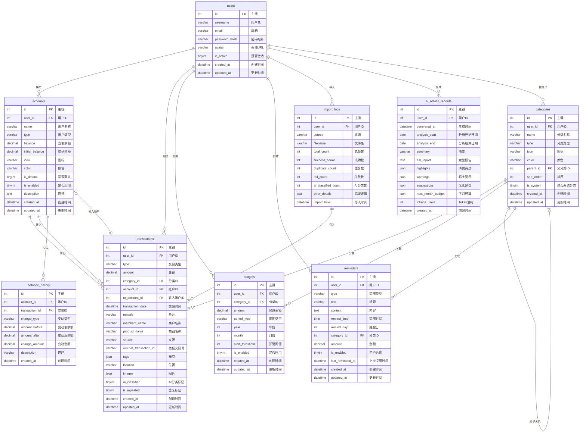

# 智能个人财务记账系统 - 数据库设计文档

## 目录

- [1. 数据库概述](#1-数据库概述)
- [2. ER 图](#2-er-图)
- [3. 数据表设计](#3-数据表设计)
- [4. 建表 SQL](#4-建表-sql)
- [5. 索引设计](#5-索引设计)
- [6. 数据字典](#6-数据字典)

---

## 1. 数据库概述

### 1.1 数据库选型

| 项目 | 选型 | 说明 |
|------|------|------|
| 数据库 | MySQL 8.0 | 成熟稳定的关系型数据库 |
| 字符集 | utf8mb4 | 支持完整的 Unicode 字符（包括 Emoji） |
| 排序规则 | utf8mb4_unicode_ci | 支持多语言排序 |
| 存储引擎 | InnoDB | 支持事务、外键、行级锁 |

### 1.2 设计原则

1. **命名规范**：表名使用小写字母 + 下划线，使用复数形式（如 `users`、`transactions`）
2. **主键设计**：使用自增整数 `id` 作为主键
3. **外键命名**：使用 `{表名单数}_id` 格式（如 `user_id`、`category_id`）
4. **时间字段**：统一使用 `created_at`、`updated_at` 命名
5. **软删除**：使用 `is_deleted` 布尔字段实现软删除（可选）
6. **金额字段**：使用 `DECIMAL(15, 2)` 类型，精确到分

### 1.3 核心数据表清单

| 序号 | 表名 | 中文名 | 说明 |
|------|------|--------|------|
| 1 | users | 用户表 | 存储用户基本信息 |
| 2 | accounts | 账户表 | 存储用户的资金账户 |
| 3 | categories | 分类表 | 存储收入/支出分类 |
| 4 | transactions | 交易记录表 | 核心业务表，存储所有交易 |
| 5 | budgets | 预算表 | 存储预算设置 |
| 6 | import_logs | 导入日志表 | 记录账单导入历史 |
| 7 | balance_history | 余额历史表 | 记录账户余额变动历史 |
| 8 | reminders | 提醒表 | 存储用户提醒设置 |
| 9 | ai_advice_records | AI 建议记录表 | 存储 AI 生成的理财建议 |

---

## 2. ER 图

### 2.1 完整 ER 图



### 2.2 表关系说明

| 关系名称 | 源表 | 目标表 | 关系类型 | 说明 |
|----------|------|--------|----------|------|
| 用户-账户 | users | accounts | 一对多 | 一个用户可拥有多个账户 |
| 用户-交易 | users | transactions | 一对多 | 一个用户可创建多条交易 |
| 用户-预算 | users | budgets | 一对多 | 一个用户可设置多个预算 |
| 用户-分类 | users | categories | 一对多 | 用户可自定义分类 |
| 用户-导入日志 | users | import_logs | 一对多 | 一个用户可多次导入 |
| 用户-AI建议 | users | ai_advice_records | 一对多 | 一个用户可生成多条建议 |
| 用户-提醒 | users | reminders | 一对多 | 一个用户可设置多个提醒 |
| 分类-交易 | categories | transactions | 一对多 | 一个分类关联多条交易 |
| 分类-预算 | categories | budgets | 一对多 | 一个分类可有多个周期预算 |
| 分类-父分类 | categories | categories | 自关联 | 支持二级分类 |
| 账户-交易 | accounts | transactions | 一对多 | 一个账户发生多条交易 |
| 账户-余额历史 | accounts | balance_history | 一对多 | 一个账户多条历史记录 |

---

## 3. 数据表设计

### 3.1 用户表 (users)

存储系统用户的基本信息。

| 字段名 | 数据类型 | 允许空 | 默认值 | 说明 |
|--------|----------|--------|--------|------|
| id | INT | NO | AUTO_INCREMENT | 主键 |
| username | VARCHAR(50) | NO | - | 用户名，唯一 |
| email | VARCHAR(100) | NO | - | 邮箱，唯一 |
| password_hash | VARCHAR(255) | NO | - | 密码哈希值（BCrypt） |
| avatar | VARCHAR(255) | YES | NULL | 头像 URL |
| is_active | TINYINT(1) | NO | 1 | 是否激活（1=是，0=否） |
| created_at | DATETIME | NO | CURRENT_TIMESTAMP | 创建时间 |
| updated_at | DATETIME | NO | CURRENT_TIMESTAMP ON UPDATE | 更新时间 |

**约束：**
- PRIMARY KEY (id)
- UNIQUE KEY uk_username (username)
- UNIQUE KEY uk_email (email)

---

### 3.2 账户表 (accounts)

存储用户的资金账户信息（现金、银行卡、微信、支付宝等）。

| 字段名 | 数据类型 | 允许空 | 默认值 | 说明 |
|--------|----------|--------|--------|------|
| id | INT | NO | AUTO_INCREMENT | 主键 |
| user_id | INT | NO | - | 用户 ID |
| name | VARCHAR(50) | NO | - | 账户名称 |
| type | VARCHAR(20) | NO | 'other' | 账户类型 |
| balance | DECIMAL(15,2) | NO | 0.00 | 当前余额 |
| initial_balance | DECIMAL(15,2) | NO | 0.00 | 初始余额 |
| icon | VARCHAR(10) | YES | NULL | 图标（Emoji） |
| color | VARCHAR(7) | YES | NULL | 颜色（十六进制） |
| is_default | TINYINT(1) | NO | 0 | 是否默认账户 |
| is_enabled | TINYINT(1) | NO | 1 | 是否启用 |
| description | TEXT | YES | NULL | 账户描述 |
| created_at | DATETIME | NO | CURRENT_TIMESTAMP | 创建时间 |
| updated_at | DATETIME | NO | CURRENT_TIMESTAMP ON UPDATE | 更新时间 |

**账户类型枚举：**
| 值 | 说明 |
|----|------|
| cash | 现金 |
| bank | 银行卡 |
| wechat | 微信 |
| alipay | 支付宝 |
| meal_card | 饭卡 |
| other | 其他 |

**约束：**
- PRIMARY KEY (id)
- FOREIGN KEY (user_id) REFERENCES users(id) ON DELETE CASCADE
- INDEX idx_user_id (user_id)

---

### 3.3 分类表 (categories)

存储收入/支出的分类信息，支持二级分类。

| 字段名 | 数据类型 | 允许空 | 默认值 | 说明 |
|--------|----------|--------|--------|------|
| id | INT | NO | AUTO_INCREMENT | 主键 |
| user_id | INT | YES | NULL | 用户 ID（系统分类为 NULL） |
| name | VARCHAR(50) | NO | - | 分类名称 |
| type | VARCHAR(20) | NO | 'expense' | 分类类型 |
| icon | VARCHAR(10) | YES | NULL | 图标（Emoji） |
| color | VARCHAR(7) | YES | NULL | 颜色（十六进制） |
| parent_id | INT | YES | NULL | 父分类 ID |
| sort_order | INT | NO | 0 | 排序序号 |
| is_system | TINYINT(1) | NO | 0 | 是否系统分类 |
| created_at | DATETIME | NO | CURRENT_TIMESTAMP | 创建时间 |
| updated_at | DATETIME | NO | CURRENT_TIMESTAMP ON UPDATE | 更新时间 |

**分类类型枚举：**
| 值 | 说明 |
|----|------|
| income | 收入 |
| expense | 支出 |

**约束：**
- PRIMARY KEY (id)
- FOREIGN KEY (user_id) REFERENCES users(id) ON DELETE CASCADE
- FOREIGN KEY (parent_id) REFERENCES categories(id) ON DELETE SET NULL
- INDEX idx_user_id (user_id)
- INDEX idx_parent_id (parent_id)
- INDEX idx_type (type)

---

### 3.4 交易记录表 (transactions)

核心业务表，存储所有交易记录。

| 字段名 | 数据类型 | 允许空 | 默认值 | 说明 |
|--------|----------|--------|--------|------|
| id | INT | NO | AUTO_INCREMENT | 主键 |
| user_id | INT | NO | - | 用户 ID |
| type | VARCHAR(20) | NO | 'expense' | 交易类型 |
| amount | DECIMAL(15,2) | NO | - | 金额（正数） |
| category_id | INT | YES | NULL | 分类 ID |
| account_id | INT | NO | - | 账户 ID |
| to_account_id | INT | YES | NULL | 转入账户 ID（转账时使用） |
| transaction_date | DATETIME | NO | - | 交易时间 |
| remark | VARCHAR(255) | YES | NULL | 备注 |
| merchant_name | VARCHAR(100) | YES | NULL | 商户名称 |
| product_name | VARCHAR(255) | YES | NULL | 商品/服务名称 |
| source | VARCHAR(20) | NO | 'manual' | 来源 |
| wechat_transaction_id | VARCHAR(64) | YES | NULL | 微信交易流水号（去重用） |
| tags | JSON | YES | NULL | 标签列表 |
| location | VARCHAR(255) | YES | NULL | 地理位置 |
| images | JSON | YES | NULL | 图片 URL 列表 |
| ai_classified | TINYINT(1) | NO | 0 | 是否由 AI 分类 |
| is_repeated | TINYINT(1) | NO | 0 | 是否标记为重复 |
| created_at | DATETIME | NO | CURRENT_TIMESTAMP | 创建时间 |
| updated_at | DATETIME | NO | CURRENT_TIMESTAMP ON UPDATE | 更新时间 |

**交易类型枚举：**
| 值 | 说明 |
|----|------|
| income | 收入 |
| expense | 支出 |
| transfer | 转账 |

**来源枚举：**
| 值 | 说明 |
|----|------|
| manual | 手动录入 |
| wechat | 微信账单导入 |
| alipay | 支付宝账单导入 |

**约束：**
- PRIMARY KEY (id)
- FOREIGN KEY (user_id) REFERENCES users(id) ON DELETE CASCADE
- FOREIGN KEY (category_id) REFERENCES categories(id) ON DELETE SET NULL
- FOREIGN KEY (account_id) REFERENCES accounts(id) ON DELETE RESTRICT
- FOREIGN KEY (to_account_id) REFERENCES accounts(id) ON DELETE SET NULL
- UNIQUE KEY uk_wechat_trans_id (wechat_transaction_id)
- INDEX idx_user_id (user_id)
- INDEX idx_category_id (category_id)
- INDEX idx_account_id (account_id)
- INDEX idx_transaction_date (transaction_date)
- INDEX idx_type (type)

---

### 3.5 预算表 (budgets)

存储用户设置的预算信息。

| 字段名 | 数据类型 | 允许空 | 默认值 | 说明 |
|--------|----------|--------|--------|------|
| id | INT | NO | AUTO_INCREMENT | 主键 |
| user_id | INT | NO | - | 用户 ID |
| category_id | INT | YES | NULL | 分类 ID（NULL 表示总预算） |
| amount | DECIMAL(15,2) | NO | - | 预算金额 |
| period_type | VARCHAR(20) | NO | 'monthly' | 周期类型 |
| year | INT | NO | - | 年份 |
| month | TINYINT | YES | NULL | 月份（1-12，月度预算使用） |
| alert_threshold | INT | NO | 80 | 预警阈值（百分比） |
| is_enabled | TINYINT(1) | NO | 1 | 是否启用 |
| created_at | DATETIME | NO | CURRENT_TIMESTAMP | 创建时间 |
| updated_at | DATETIME | NO | CURRENT_TIMESTAMP ON UPDATE | 更新时间 |

**周期类型枚举：**
| 值 | 说明 |
|----|------|
| monthly | 月度预算 |
| yearly | 年度预算 |

**约束：**
- PRIMARY KEY (id)
- FOREIGN KEY (user_id) REFERENCES users(id) ON DELETE CASCADE
- FOREIGN KEY (category_id) REFERENCES categories(id) ON DELETE CASCADE
- UNIQUE KEY uk_user_period (user_id, category_id, period_type, year, month)
- INDEX idx_user_id (user_id)
- INDEX idx_category_id (category_id)
- INDEX idx_period (period_type, year, month)

---

### 3.6 导入日志表 (import_logs)

记录账单导入的历史。

| 字段名 | 数据类型 | 允许空 | 默认值 | 说明 |
|--------|----------|--------|--------|------|
| id | INT | NO | AUTO_INCREMENT | 主键 |
| user_id | INT | NO | - | 用户 ID |
| source | VARCHAR(20) | NO | - | 来源 |
| filename | VARCHAR(255) | YES | NULL | 文件名 |
| total_count | INT | NO | 0 | 总条数 |
| success_count | INT | NO | 0 | 成功导入数 |
| duplicate_count | INT | NO | 0 | 重复跳过数 |
| fail_count | INT | NO | 0 | 失败数 |
| ai_classified_count | INT | NO | 0 | AI 分类数 |
| error_details | TEXT | YES | NULL | 错误详情（JSON） |
| import_time | DATETIME | NO | CURRENT_TIMESTAMP | 导入时间 |

**约束：**
- PRIMARY KEY (id)
- FOREIGN KEY (user_id) REFERENCES users(id) ON DELETE CASCADE
- INDEX idx_user_id (user_id)
- INDEX idx_import_time (import_time)

---

### 3.7 余额历史表 (balance_history)

记录账户余额变动历史。

| 字段名 | 数据类型 | 允许空 | 默认值 | 说明 |
|--------|----------|--------|--------|------|
| id | INT | NO | AUTO_INCREMENT | 主键 |
| account_id | INT | NO | - | 账户 ID |
| transaction_id | INT | YES | NULL | 关联交易 ID |
| change_type | VARCHAR(20) | NO | - | 变动类型 |
| amount_before | DECIMAL(15,2) | NO | - | 变动前余额 |
| amount_after | DECIMAL(15,2) | NO | - | 变动后余额 |
| change_amount | DECIMAL(15,2) | NO | - | 变动金额（正/负） |
| description | VARCHAR(255) | YES | NULL | 描述 |
| created_at | DATETIME | NO | CURRENT_TIMESTAMP | 创建时间 |

**变动类型枚举：**
| 值 | 说明 |
|----|------|
| income | 收入 |
| expense | 支出 |
| transfer_in | 转入 |
| transfer_out | 转出 |
| adjust | 余额调整 |

**约束：**
- PRIMARY KEY (id)
- FOREIGN KEY (account_id) REFERENCES accounts(id) ON DELETE CASCADE
- FOREIGN KEY (transaction_id) REFERENCES transactions(id) ON DELETE SET NULL
- INDEX idx_account_id (account_id)
- INDEX idx_transaction_id (transaction_id)
- INDEX idx_created_at (created_at)

---

### 3.8 提醒表 (reminders)

存储用户设置的提醒。

| 字段名 | 数据类型 | 允许空 | 默认值 | 说明 |
|--------|----------|--------|--------|------|
| id | INT | NO | AUTO_INCREMENT | 主键 |
| user_id | INT | NO | - | 用户 ID |
| type | VARCHAR(20) | NO | - | 提醒类型 |
| title | VARCHAR(100) | NO | - | 标题 |
| content | TEXT | YES | NULL | 内容 |
| remind_time | TIME | YES | NULL | 提醒时间 |
| remind_day | TINYINT | YES | NULL | 提醒日（1-31） |
| category_id | INT | YES | NULL | 关联分类 ID |
| amount | DECIMAL(15,2) | YES | NULL | 关联金额 |
| is_enabled | TINYINT(1) | NO | 1 | 是否启用 |
| last_reminded_at | DATETIME | YES | NULL | 上次提醒时间 |
| created_at | DATETIME | NO | CURRENT_TIMESTAMP | 创建时间 |
| updated_at | DATETIME | NO | CURRENT_TIMESTAMP ON UPDATE | 更新时间 |

**提醒类型枚举：**
| 值 | 说明 |
|----|------|
| daily | 每日记账提醒 |
| budget | 预算预警 |
| recurring | 周期性提醒 |
| report | 报告提醒 |

**约束：**
- PRIMARY KEY (id)
- FOREIGN KEY (user_id) REFERENCES users(id) ON DELETE CASCADE
- FOREIGN KEY (category_id) REFERENCES categories(id) ON DELETE SET NULL
- INDEX idx_user_id (user_id)
- INDEX idx_type (type)

---

### 3.9 AI 建议记录表 (ai_advice_records)

存储 AI 生成的理财建议记录。

| 字段名 | 数据类型 | 允许空 | 默认值 | 说明 |
|--------|----------|--------|--------|------|
| id | INT | NO | AUTO_INCREMENT | 主键 |
| user_id | INT | NO | - | 用户 ID |
| generated_at | DATETIME | NO | CURRENT_TIMESTAMP | 生成时间 |
| analysis_start | DATE | NO | - | 分析开始日期 |
| analysis_end | DATE | NO | - | 分析结束日期 |
| summary | VARCHAR(255) | YES | NULL | 一句话摘要 |
| full_report | TEXT | YES | NULL | 完整 Markdown 报告 |
| highlights | JSON | YES | NULL | 消费亮点数组 |
| warnings | JSON | YES | NULL | 超支警示数组 |
| suggestions | JSON | YES | NULL | 优化建议数组 |
| next_month_budget | JSON | YES | NULL | 下月预算建议 |
| tokens_used | INT | NO | 0 | Token 消耗数 |
| created_at | DATETIME | NO | CURRENT_TIMESTAMP | 创建时间 |

**约束：**
- PRIMARY KEY (id)
- FOREIGN KEY (user_id) REFERENCES users(id) ON DELETE CASCADE
- INDEX idx_user_id (user_id)
- INDEX idx_generated_at (generated_at)

---

## 4. 建表 SQL

### 4.1 创建数据库

```sql
-- 创建数据库
CREATE DATABASE IF NOT EXISTS finance_db
    CHARACTER SET utf8mb4
    COLLATE utf8mb4_unicode_ci;

-- 使用数据库
USE finance_db;
```

### 4.2 创建用户表

```sql
-- 用户表
CREATE TABLE users (
    id INT AUTO_INCREMENT PRIMARY KEY COMMENT '主键',
    username VARCHAR(50) NOT NULL COMMENT '用户名',
    email VARCHAR(100) NOT NULL COMMENT '邮箱',
    password_hash VARCHAR(255) NOT NULL COMMENT '密码哈希值',
    avatar VARCHAR(255) DEFAULT NULL COMMENT '头像URL',
    is_active TINYINT(1) NOT NULL DEFAULT 1 COMMENT '是否激活',
    created_at DATETIME NOT NULL DEFAULT CURRENT_TIMESTAMP COMMENT '创建时间',
    updated_at DATETIME NOT NULL DEFAULT CURRENT_TIMESTAMP ON UPDATE CURRENT_TIMESTAMP COMMENT '更新时间',

    UNIQUE KEY uk_username (username),
    UNIQUE KEY uk_email (email)
) ENGINE=InnoDB DEFAULT CHARSET=utf8mb4 COLLATE=utf8mb4_unicode_ci COMMENT='用户表';
```

### 4.3 创建账户表

```sql
-- 账户表
CREATE TABLE accounts (
    id INT AUTO_INCREMENT PRIMARY KEY COMMENT '主键',
    user_id INT NOT NULL COMMENT '用户ID',
    name VARCHAR(50) NOT NULL COMMENT '账户名称',
    type VARCHAR(20) NOT NULL DEFAULT 'other' COMMENT '账户类型: cash/bank/wechat/alipay/meal_card/other',
    balance DECIMAL(15,2) NOT NULL DEFAULT 0.00 COMMENT '当前余额',
    initial_balance DECIMAL(15,2) NOT NULL DEFAULT 0.00 COMMENT '初始余额',
    icon VARCHAR(10) DEFAULT NULL COMMENT '图标(Emoji)',
    color VARCHAR(7) DEFAULT NULL COMMENT '颜色(十六进制)',
    is_default TINYINT(1) NOT NULL DEFAULT 0 COMMENT '是否默认账户',
    is_enabled TINYINT(1) NOT NULL DEFAULT 1 COMMENT '是否启用',
    description TEXT DEFAULT NULL COMMENT '账户描述',
    created_at DATETIME NOT NULL DEFAULT CURRENT_TIMESTAMP COMMENT '创建时间',
    updated_at DATETIME NOT NULL DEFAULT CURRENT_TIMESTAMP ON UPDATE CURRENT_TIMESTAMP COMMENT '更新时间',

    CONSTRAINT fk_accounts_user FOREIGN KEY (user_id) REFERENCES users(id) ON DELETE CASCADE,
    INDEX idx_user_id (user_id),
    INDEX idx_type (type)
) ENGINE=InnoDB DEFAULT CHARSET=utf8mb4 COLLATE=utf8mb4_unicode_ci COMMENT='账户表';
```

### 4.4 创建分类表

```sql
-- 分类表
CREATE TABLE categories (
    id INT AUTO_INCREMENT PRIMARY KEY COMMENT '主键',
    user_id INT DEFAULT NULL COMMENT '用户ID(系统分类为NULL)',
    name VARCHAR(50) NOT NULL COMMENT '分类名称',
    type VARCHAR(20) NOT NULL DEFAULT 'expense' COMMENT '分类类型: income/expense',
    icon VARCHAR(10) DEFAULT NULL COMMENT '图标(Emoji)',
    color VARCHAR(7) DEFAULT NULL COMMENT '颜色(十六进制)',
    parent_id INT DEFAULT NULL COMMENT '父分类ID',
    sort_order INT NOT NULL DEFAULT 0 COMMENT '排序序号',
    is_system TINYINT(1) NOT NULL DEFAULT 0 COMMENT '是否系统分类',
    created_at DATETIME NOT NULL DEFAULT CURRENT_TIMESTAMP COMMENT '创建时间',
    updated_at DATETIME NOT NULL DEFAULT CURRENT_TIMESTAMP ON UPDATE CURRENT_TIMESTAMP COMMENT '更新时间',

    CONSTRAINT fk_categories_user FOREIGN KEY (user_id) REFERENCES users(id) ON DELETE CASCADE,
    CONSTRAINT fk_categories_parent FOREIGN KEY (parent_id) REFERENCES categories(id) ON DELETE SET NULL,
    INDEX idx_user_id (user_id),
    INDEX idx_parent_id (parent_id),
    INDEX idx_type (type),
    INDEX idx_is_system (is_system)
) ENGINE=InnoDB DEFAULT CHARSET=utf8mb4 COLLATE=utf8mb4_unicode_ci COMMENT='分类表';
```

### 4.5 创建交易记录表

```sql
-- 交易记录表
CREATE TABLE transactions (
    id INT AUTO_INCREMENT PRIMARY KEY COMMENT '主键',
    user_id INT NOT NULL COMMENT '用户ID',
    type VARCHAR(20) NOT NULL DEFAULT 'expense' COMMENT '交易类型: income/expense/transfer',
    amount DECIMAL(15,2) NOT NULL COMMENT '金额',
    category_id INT DEFAULT NULL COMMENT '分类ID',
    account_id INT NOT NULL COMMENT '账户ID',
    to_account_id INT DEFAULT NULL COMMENT '转入账户ID(转账时使用)',
    transaction_date DATETIME NOT NULL COMMENT '交易时间',
    remark VARCHAR(255) DEFAULT NULL COMMENT '备注',
    merchant_name VARCHAR(100) DEFAULT NULL COMMENT '商户名称',
    product_name VARCHAR(255) DEFAULT NULL COMMENT '商品/服务名称',
    source VARCHAR(20) NOT NULL DEFAULT 'manual' COMMENT '来源: manual/wechat/alipay',
    wechat_transaction_id VARCHAR(64) DEFAULT NULL COMMENT '微信交易流水号',
    tags JSON DEFAULT NULL COMMENT '标签列表',
    location VARCHAR(255) DEFAULT NULL COMMENT '地理位置',
    images JSON DEFAULT NULL COMMENT '图片URL列表',
    ai_classified TINYINT(1) NOT NULL DEFAULT 0 COMMENT '是否由AI分类',
    is_repeated TINYINT(1) NOT NULL DEFAULT 0 COMMENT '是否标记为重复',
    created_at DATETIME NOT NULL DEFAULT CURRENT_TIMESTAMP COMMENT '创建时间',
    updated_at DATETIME NOT NULL DEFAULT CURRENT_TIMESTAMP ON UPDATE CURRENT_TIMESTAMP COMMENT '更新时间',

    CONSTRAINT fk_transactions_user FOREIGN KEY (user_id) REFERENCES users(id) ON DELETE CASCADE,
    CONSTRAINT fk_transactions_category FOREIGN KEY (category_id) REFERENCES categories(id) ON DELETE SET NULL,
    CONSTRAINT fk_transactions_account FOREIGN KEY (account_id) REFERENCES accounts(id) ON DELETE RESTRICT,
    CONSTRAINT fk_transactions_to_account FOREIGN KEY (to_account_id) REFERENCES accounts(id) ON DELETE SET NULL,
    UNIQUE KEY uk_wechat_trans_id (wechat_transaction_id),
    INDEX idx_user_id (user_id),
    INDEX idx_category_id (category_id),
    INDEX idx_account_id (account_id),
    INDEX idx_to_account_id (to_account_id),
    INDEX idx_transaction_date (transaction_date),
    INDEX idx_type (type),
    INDEX idx_source (source)
) ENGINE=InnoDB DEFAULT CHARSET=utf8mb4 COLLATE=utf8mb4_unicode_ci COMMENT='交易记录表';
```

### 4.6 创建预算表

```sql
-- 预算表
CREATE TABLE budgets (
    id INT AUTO_INCREMENT PRIMARY KEY COMMENT '主键',
    user_id INT NOT NULL COMMENT '用户ID',
    category_id INT DEFAULT NULL COMMENT '分类ID(NULL表示总预算)',
    amount DECIMAL(15,2) NOT NULL COMMENT '预算金额',
    period_type VARCHAR(20) NOT NULL DEFAULT 'monthly' COMMENT '周期类型: monthly/yearly',
    year INT NOT NULL COMMENT '年份',
    month TINYINT DEFAULT NULL COMMENT '月份(1-12)',
    alert_threshold INT NOT NULL DEFAULT 80 COMMENT '预警阈值(百分比)',
    is_enabled TINYINT(1) NOT NULL DEFAULT 1 COMMENT '是否启用',
    created_at DATETIME NOT NULL DEFAULT CURRENT_TIMESTAMP COMMENT '创建时间',
    updated_at DATETIME NOT NULL DEFAULT CURRENT_TIMESTAMP ON UPDATE CURRENT_TIMESTAMP COMMENT '更新时间',

    CONSTRAINT fk_budgets_user FOREIGN KEY (user_id) REFERENCES users(id) ON DELETE CASCADE,
    CONSTRAINT fk_budgets_category FOREIGN KEY (category_id) REFERENCES categories(id) ON DELETE CASCADE,
    UNIQUE KEY uk_user_period (user_id, category_id, period_type, year, month),
    INDEX idx_user_id (user_id),
    INDEX idx_category_id (category_id),
    INDEX idx_period (period_type, year, month)
) ENGINE=InnoDB DEFAULT CHARSET=utf8mb4 COLLATE=utf8mb4_unicode_ci COMMENT='预算表';
```

### 4.7 创建导入日志表

```sql
-- 导入日志表
CREATE TABLE import_logs (
    id INT AUTO_INCREMENT PRIMARY KEY COMMENT '主键',
    user_id INT NOT NULL COMMENT '用户ID',
    source VARCHAR(20) NOT NULL COMMENT '来源: wechat/alipay',
    filename VARCHAR(255) DEFAULT NULL COMMENT '文件名',
    total_count INT NOT NULL DEFAULT 0 COMMENT '总条数',
    success_count INT NOT NULL DEFAULT 0 COMMENT '成功导入数',
    duplicate_count INT NOT NULL DEFAULT 0 COMMENT '重复跳过数',
    fail_count INT NOT NULL DEFAULT 0 COMMENT '失败数',
    ai_classified_count INT NOT NULL DEFAULT 0 COMMENT 'AI分类数',
    error_details TEXT DEFAULT NULL COMMENT '错误详情(JSON)',
    import_time DATETIME NOT NULL DEFAULT CURRENT_TIMESTAMP COMMENT '导入时间',

    CONSTRAINT fk_import_logs_user FOREIGN KEY (user_id) REFERENCES users(id) ON DELETE CASCADE,
    INDEX idx_user_id (user_id),
    INDEX idx_source (source),
    INDEX idx_import_time (import_time)
) ENGINE=InnoDB DEFAULT CHARSET=utf8mb4 COLLATE=utf8mb4_unicode_ci COMMENT='导入日志表';
```

### 4.8 创建余额历史表

```sql
-- 余额历史表
CREATE TABLE balance_history (
    id INT AUTO_INCREMENT PRIMARY KEY COMMENT '主键',
    account_id INT NOT NULL COMMENT '账户ID',
    transaction_id INT DEFAULT NULL COMMENT '关联交易ID',
    change_type VARCHAR(20) NOT NULL COMMENT '变动类型: income/expense/transfer_in/transfer_out/adjust',
    amount_before DECIMAL(15,2) NOT NULL COMMENT '变动前余额',
    amount_after DECIMAL(15,2) NOT NULL COMMENT '变动后余额',
    change_amount DECIMAL(15,2) NOT NULL COMMENT '变动金额',
    description VARCHAR(255) DEFAULT NULL COMMENT '描述',
    created_at DATETIME NOT NULL DEFAULT CURRENT_TIMESTAMP COMMENT '创建时间',

    CONSTRAINT fk_balance_history_account FOREIGN KEY (account_id) REFERENCES accounts(id) ON DELETE CASCADE,
    CONSTRAINT fk_balance_history_transaction FOREIGN KEY (transaction_id) REFERENCES transactions(id) ON DELETE SET NULL,
    INDEX idx_account_id (account_id),
    INDEX idx_transaction_id (transaction_id),
    INDEX idx_change_type (change_type),
    INDEX idx_created_at (created_at)
) ENGINE=InnoDB DEFAULT CHARSET=utf8mb4 COLLATE=utf8mb4_unicode_ci COMMENT='余额历史表';
```

### 4.9 创建提醒表

```sql
-- 提醒表
CREATE TABLE reminders (
    id INT AUTO_INCREMENT PRIMARY KEY COMMENT '主键',
    user_id INT NOT NULL COMMENT '用户ID',
    type VARCHAR(20) NOT NULL COMMENT '提醒类型: daily/budget/recurring/report',
    title VARCHAR(100) NOT NULL COMMENT '标题',
    content TEXT DEFAULT NULL COMMENT '内容',
    remind_time TIME DEFAULT NULL COMMENT '提醒时间',
    remind_day TINYINT DEFAULT NULL COMMENT '提醒日(1-31)',
    category_id INT DEFAULT NULL COMMENT '关联分类ID',
    amount DECIMAL(15,2) DEFAULT NULL COMMENT '关联金额',
    is_enabled TINYINT(1) NOT NULL DEFAULT 1 COMMENT '是否启用',
    last_reminded_at DATETIME DEFAULT NULL COMMENT '上次提醒时间',
    created_at DATETIME NOT NULL DEFAULT CURRENT_TIMESTAMP COMMENT '创建时间',
    updated_at DATETIME NOT NULL DEFAULT CURRENT_TIMESTAMP ON UPDATE CURRENT_TIMESTAMP COMMENT '更新时间',

    CONSTRAINT fk_reminders_user FOREIGN KEY (user_id) REFERENCES users(id) ON DELETE CASCADE,
    CONSTRAINT fk_reminders_category FOREIGN KEY (category_id) REFERENCES categories(id) ON DELETE SET NULL,
    INDEX idx_user_id (user_id),
    INDEX idx_type (type),
    INDEX idx_is_enabled (is_enabled)
) ENGINE=InnoDB DEFAULT CHARSET=utf8mb4 COLLATE=utf8mb4_unicode_ci COMMENT='提醒表';
```

### 4.10 创建 AI 建议记录表

```sql
-- AI建议记录表
CREATE TABLE ai_advice_records (
    id INT AUTO_INCREMENT PRIMARY KEY COMMENT '主键',
    user_id INT NOT NULL COMMENT '用户ID',
    generated_at DATETIME NOT NULL DEFAULT CURRENT_TIMESTAMP COMMENT '生成时间',
    analysis_start DATE NOT NULL COMMENT '分析开始日期',
    analysis_end DATE NOT NULL COMMENT '分析结束日期',
    summary VARCHAR(255) DEFAULT NULL COMMENT '一句话摘要',
    full_report TEXT DEFAULT NULL COMMENT '完整Markdown报告',
    highlights JSON DEFAULT NULL COMMENT '消费亮点数组',
    warnings JSON DEFAULT NULL COMMENT '超支警示数组',
    suggestions JSON DEFAULT NULL COMMENT '优化建议数组',
    next_month_budget JSON DEFAULT NULL COMMENT '下月预算建议',
    tokens_used INT NOT NULL DEFAULT 0 COMMENT 'Token消耗数',
    created_at DATETIME NOT NULL DEFAULT CURRENT_TIMESTAMP COMMENT '创建时间',

    CONSTRAINT fk_ai_advice_records_user FOREIGN KEY (user_id) REFERENCES users(id) ON DELETE CASCADE,
    INDEX idx_user_id (user_id),
    INDEX idx_generated_at (generated_at)
) ENGINE=InnoDB DEFAULT CHARSET=utf8mb4 COLLATE=utf8mb4_unicode_ci COMMENT='AI建议记录表';
```

### 4.11 初始化系统分类数据

```sql
-- 插入系统支出分类
INSERT INTO categories (name, type, icon, color, sort_order, is_system) VALUES
('餐饮', 'expense', '🍔', '#FF6B6B', 1, 1),
('交通', 'expense', '🚗', '#4ECDC4', 2, 1),
('购物', 'expense', '🛒', '#45B7D1', 3, 1),
('娱乐', 'expense', '🎮', '#96CEB4', 4, 1),
('居住', 'expense', '🏠', '#FFEAA7', 5, 1),
('通讯', 'expense', '📱', '#DDA0DD', 6, 1),
('医疗', 'expense', '🏥', '#98D8C8', 7, 1),
('教育', 'expense', '📚', '#F7DC6F', 8, 1),
('社交', 'expense', '👥', '#BB8FCE', 9, 1),
('美容', 'expense', '💄', '#F8B500', 10, 1),
('运动', 'expense', '⚽', '#58D68D', 11, 1),
('宠物', 'expense', '🐕', '#F5B7B1', 12, 1),
('其他', 'expense', '📦', '#BDC3C7', 99, 1);

-- 插入系统收入分类
INSERT INTO categories (name, type, icon, color, sort_order, is_system) VALUES
('工资', 'income', '💰', '#27AE60', 1, 1),
('奖金', 'income', '🎁', '#2ECC71', 2, 1),
('兼职', 'income', '💼', '#58D68D', 3, 1),
('投资', 'income', '📈', '#82E0AA', 4, 1),
('红包', 'income', '🧧', '#E74C3C', 5, 1),
('其他', 'income', '💵', '#BDC3C7', 99, 1);
```

---

## 5. 索引设计

### 5.1 索引策略

| 表名 | 索引名 | 索引类型 | 字段 | 说明 |
|------|--------|----------|------|------|
| users | uk_username | UNIQUE | username | 用户名唯一 |
| users | uk_email | UNIQUE | email | 邮箱唯一 |
| accounts | idx_user_id | NORMAL | user_id | 用户查询 |
| categories | idx_user_type | NORMAL | user_id, type | 用户分类查询 |
| transactions | idx_user_date | NORMAL | user_id, transaction_date | 交易日期范围查询 |
| transactions | idx_user_type_date | NORMAL | user_id, type, transaction_date | 按类型查询 |
| transactions | idx_wechat_trans_id | UNIQUE | wechat_transaction_id | 微信去重 |
| budgets | idx_user_period | NORMAL | user_id, year, month | 预算周期查询 |
| balance_history | idx_account_date | NORMAL | account_id, created_at | 余额历史查询 |

### 5.2 查询优化建议

1. **交易列表查询**：使用复合索引 `(user_id, transaction_date DESC)`
2. **分类统计查询**：使用复合索引 `(user_id, category_id, transaction_date)`
3. **预算进度查询**：使用复合索引 `(user_id, year, month)`
4. **微信去重检测**：使用唯一索引 `wechat_transaction_id`

---

## 6. 数据字典

### 6.1 账户类型 (account_type)

| 值 | 中文名 | 说明 |
|----|--------|------|
| cash | 现金 | 现金账户 |
| bank | 银行卡 | 银行储蓄卡/信用卡 |
| wechat | 微信 | 微信钱包 |
| alipay | 支付宝 | 支付宝余额 |
| meal_card | 饭卡 | 公司/学校饭卡 |
| other | 其他 | 其他类型账户 |

### 6.2 交易类型 (transaction_type)

| 值 | 中文名 | 说明 |
|----|--------|------|
| income | 收入 | 资金流入 |
| expense | 支出 | 资金流出 |
| transfer | 转账 | 账户间转移 |

### 6.3 分类类型 (category_type)

| 值 | 中文名 | 说明 |
|----|--------|------|
| income | 收入分类 | 用于收入交易 |
| expense | 支出分类 | 用于支出交易 |

### 6.4 预算周期 (period_type)

| 值 | 中文名 | 说明 |
|----|--------|------|
| monthly | 月度 | 每月重置的预算 |
| yearly | 年度 | 每年重置的预算 |

### 6.5 交易来源 (source)

| 值 | 中文名 | 说明 |
|----|--------|------|
| manual | 手动录入 | 用户手动添加 |
| wechat | 微信账单 | 从微信账单导入 |
| alipay | 支付宝账单 | 从支付宝账单导入 |

### 6.6 余额变动类型 (change_type)

| 值 | 中文名 | 说明 |
|----|--------|------|
| income | 收入 | 收入导致余额增加 |
| expense | 支出 | 支出导致余额减少 |
| transfer_in | 转入 | 从其他账户转入 |
| transfer_out | 转出 | 转出到其他账户 |
| adjust | 余额调整 | 手动校正余额 |

### 6.7 提醒类型 (reminder_type)

| 值 | 中文名 | 说明 |
|----|--------|------|
| daily | 每日提醒 | 每日记账提醒 |
| budget | 预算预警 | 预算超支预警 |
| recurring | 周期提醒 | 定期周期性提醒 |
| report | 报告提醒 | 月度/年度报告提醒 |

---

## 7. 数据库版本历史

| 版本 | 日期 | 说明 |
|------|------|------|
| 1.0.0 | 2026-03-21 | 初始版本，完成核心表设计 |
