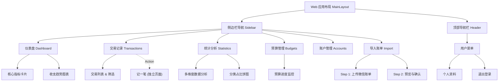

# 智能个人财务记账系统 设计说明（Design Spec）

## 1. 用户研究

### 1.1 目标用户群体

本项目核心面向以下用户：

1. **大学生（18-24 岁）**  
	- 收入来源以生活费、兼职、奖学金为主，消费频次高但单笔金额相对较低。  
	- 记账习惯不稳定，容易出现“想记但懒得记”与月末复盘困难。

2. **初入职场的年轻人（22-30 岁）**  
	- 收入相对稳定，但消费场景复杂（通勤、外卖、社交、娱乐）。  
	- 关注预算控制与结余提升，希望获得可执行的理财建议。

3. **数字支付重度用户**  
	- 高频使用微信支付/支付宝，账单分散在不同平台。  
	- 对“导入账单 + 自动分类 + 快速复盘”有强需求。

### 1.2 核心用户场景（至少 3 个）

#### 场景 A：日常快速记账（高频）
- 用户在消费后 10 秒内完成一笔支出录入（金额、分类、账户、时间、备注）。
- 目标：降低记录成本，减少漏记。

#### 场景 B：月初导入微信账单并自动分类（高价值）
- 用户上传微信账单 CSV/XLSX，系统完成解析、去重与智能分类，用户确认后批量导入。
- 目标：替代人工逐条补录，提升导入效率与分类准确度。

#### 场景 C：预算预警与消费控制（持续性）
- 用户设置总预算/分类预算后，系统实时计算预算使用率并触发预警。
- 目标：在“超支前”提醒，而不是“超支后”复盘。

#### 场景 D：月度复盘与 AI 建议（决策支持）
- 用户查看收入/支出趋势、分类占比、消费异常，并获取 AI 生成的个性化建议。
- 目标：把“数据展示”转化为“可执行行动”。

### 1.3 简要竞品分析（可选）

| 竞品 | 优势 | 局限 | 本项目差异化方向 |
|------|------|------|------------------|
| 随手记/鲨鱼记账（传统记账类） | 记账流程成熟、分类体系完善 | 对多源账单智能处理能力有限，建议偏模板化 | 强化“微信账单导入 + AI 语义分类 + 个性化建议”闭环 |
| 支付平台内置账单功能 | 数据天然完整、查询方便 | 跨平台收支整合弱，预算和目标管理能力不足 | 聚合多账户数据，提供统一预算与趋势分析 |
| 通用 AI 记账助手（聊天式） | 交互灵活、解释性强 | 结构化财务数据管理不稳定，长期统计能力弱 | 以结构化账本为核心，AI 作为增强层而非替代层 |

---

## 2. 设计规范 (Design Specifications)

### 2.1 平台设计规范遵循

为保证跨端一致性与可用性，系统遵循以下设计规范：

1. **Material Design（Web/Android）**
	- 信息层级清晰：使用卡片化布局承载收支、预算、统计信息。
	- 交互反馈明确：按钮、输入、加载与错误状态具备可见反馈。
	- 组件一致性：统一使用设计系统组件（表单、弹窗、列表、标签）。

2. **iOS HIG（iOS 适配）**
	- 优先内容可读性：减少装饰性元素，突出关键财务数字。
	- 保持手势和导航习惯：页面返回、分层导航、操作确认符合 iOS 习惯。
	- 动效克制：以状态过渡为主，避免干扰核心记账任务。

### 2.2 统一颜色方案（Color System）

> 原则：财务产品强调“清晰、稳定、可预警”。主色用于品牌与主操作，辅助色用于中性信息，强调色用于风险提示。

| 角色 | Token | 色值 | 使用场景 |
|------|-------|------|----------|
| 主色（Primary） | `color-primary` | `#16A34A` | 主按钮、激活态、关键正向数据 |
| 主色深色 | `color-primary-700` | `#15803D` | 主按钮 hover/pressed |
| 辅助色（Secondary） | `color-secondary` | `#0EA5E9` | 次级操作、链接、图表辅助系列 |
| 强调色（Accent） | `color-accent` | `#F59E0B` | 预算预警（接近阈值） |
| 危险色（Error） | `color-error` | `#EF4444` | 超支、删除、错误提示 |
| 成功色（Success） | `color-success` | `#22C55E` | 导入成功、达成预算目标 |
| 文本主色 | `color-text-primary` | `#111827` | 标题、关键数字 |
| 文本次色 | `color-text-secondary` | `#4B5563` | 普通描述文本 |
| 分割线/边框 | `color-border` | `#E5E7EB` | 分割线、输入框边框 |
| 页面背景 | `color-bg` | `#F9FAFB` | 页面基础背景 |

### 2.3 字体规范（Typography）

| 层级 | 字号 | 字重 | 行高 | 使用场景 |
|------|------|------|------|----------|
| Display | 32px | 700 | 40px | 首页核心金额（总资产/结余） |
| H1 | 24px | 700 | 32px | 页面主标题 |
| H2 | 20px | 600 | 28px | 模块标题 |
| H3 | 18px | 600 | 26px | 分组标题 |
| Body | 14px | 400 | 22px | 常规正文 |
| Caption | 12px | 400 | 18px | 辅助说明、时间、标签 |

字体建议：
- 中文：`PingFang SC`、`Microsoft YaHei`、`Noto Sans SC`
- 英文与数字：`Inter`、系统无衬线字体回退

### 2.4 间距规范（Spacing）

采用 4px 基础栅格，统一间距 Token：

| Token | 数值 | 建议用途 |
|------|------|----------|
| `space-1` | 4px | 图标与文字微间距 |
| `space-2` | 8px | 标签、输入项内间距 |
| `space-3` | 12px | 组件内部元素间距 |
| `space-4` | 16px | 卡片内边距、列表项标准间距 |
| `space-5` | 20px | 模块内分组间距 |
| `space-6` | 24px | 页面区块间距 |
| `space-8` | 32px | 页面级留白 |

布局约定：
- 移动端页面左右安全边距建议 `16px`。
- PC 端内容区建议采用 `1200px` 以内栅格布局。
- 卡片圆角统一建议 `12px`，输入框圆角建议 `8px`。

### 2.5 一致性与可访问性要求

- 对比度满足 WCAG 可读性要求（正文文本建议不低于 4.5:1）。
- 颜色不作为唯一信息表达方式（预算状态需同时使用文案/图标）。
- 关键操作（删除、导入覆盖）需二次确认。
- 表单错误提示应靠近输入项并给出可执行修复建议。

---

## 3. 信息架构 (Information Architecture)

### 3.1 架构图

### 3.2 核心导航结构

- **桌面端 (Desktop) - 侧边栏导航**:
  -  **仪表盘 (Dashboard)**: `/dashboard` - 财务概览与核心指标。
  -  **交易记录 (Transactions)**: `/transactions` - 查看明细与记一笔 (`/transactions/add` 为独立页面)。
  -  **统计分析 (Statistics)**: `/statistics` - 多维度报表分析。
  -  **预算管理 (Budgets)**: `/budgets` - 设定与监控月度预算。
  -  **账户管理 (Accounts)**: `/accounts` - 管理各个资产账户。
  -  **导入账单 (Import)**: `/wechat/import` - 专用于微信账单的批量导入。

---

## 4. 核心页面原型设计说明 (Core Page Design)

### 4.1 仪表盘 (Dashboard)
- **功能目标**: 用户的默认着陆页，提供“上帝视角”的财务概览。
- **页面布局**: Header + Sidebar 布局。
- **核心组件**:
  1. **顶部栏**: 显示当前月份选择器 (`MonthPicker`)。
  2. **概览卡片组 (4 Cards)**:
     - **本月收入**: 金额 + 环比增长趋势箭头 (绿涨红跌)。
     - **本月支出**: 金额 + 环比趋势。
     - **本月结余**: 净值显示。
     - **总资产**: 所有账户余额汇总。
  3. **图表区域**:
     - **左侧**: [最近7天支出趋势] (折线图 LineChart)，直观展示短期消费波动。
     - **右侧**: [支出分类占比] (饼图 PieChart)，展示本月主要消费去向。

### 4.2 添加交易 (Add Transaction)
- **功能目标**: 独立的沉浸式记账页面 (`/transactions/add`)，而非弹窗。
- **核心交互**:
  1. **类型切换**: 顶部大尺寸 Tabs 切换 [支出 | 收入 | 转账]。
  2. **金额输入**: 醒目的金额输入框 (类似 ATM机风格)，大号字体显示。
  3. **分类选择**:
     - **网格布局 (Grid)**: 图标 + 名称的卡片矩阵，点击高亮选中。
     - **空状态处理**: 若无分类显示“暂无分类，请先添加”。
  4. **表单详情**:
     - **账户选择**: 下拉框显示账户名称及当前余额。
     - **日期选择**: 默认为今天。
     - **备注与标签**: 辅助信息输入。
  5. **操作栏**: 底部固定“保存”按钮。

### 4.3 微信账单导入 (Wechat Import)
- **功能目标**: 引导用户完成复杂的微信账单导入流程。
- **UI 模式**: 分步向导 (Stepper) + 弹窗/卡片容器。
- **步骤流程**:
  1. **选择文件**: 
     - 大面积拖拽上传区 (Drag & Drop)。
     - **帮助指引**: 右侧或下方展示“如何从微信导出账单”的 8 步图文教程。
  2. **预览数据**:
     - 表格展示解析结果 (日期/通过/金额/分类)。
     - **智能状态**: 自动标记“待确认”(黄色) 和 “已匹配”(绿色) 的行。
  3. **导入设置**: 关联转入账户等参数。
  4. **完成**: 显示成功导入条数汇总。

### 4.4 统计分析 (Statistics)
- **功能目标**: 深度交互的数据分析看板。
- **核心组件**:
  1. **顶部筛选栏 (Filter Card)**:
     - **模式切换**: [收支趋势] vs [分类统计]。
  2. **趋势模式 (Trend View)**:
     - 筛选: 按日/周/月/年，自定义日期范围。
     - 图表: 动态折线图/柱状图。
  3. **分类模式 (Category View)**:
     - 筛选: [支出/收入]，选择 [年份/月份]。
     - 图表: 大尺寸饼图/环形图 + 排行榜列表。

### 4.5 预算管理 (Budget Management)
- **功能目标**: 独立的预算设置与监控页面。
- **核心组件**:
  - **总预算卡片**: 仪表盘形式展示全月总预算进度。
  - **分类预算列表**: 每一个分类 (如餐饮、交通) 的独立进度条。
  - **编辑操作**: 点击列表项可直接修改预算金额或删除预算。

---

## 5. 交互逻辑说明 (Interaction Logic)

### 5.1 导航与路由
- **一级导航**: 左侧侧边栏 (Sidebar) 常驻，点击菜单项进行模块跳转 (Vue Router)。
- **用户菜单**: 右上角头像 Hover 触发下拉菜单，访问 [个人资料] 或 [退出]。
- **记账路由**: 从任意页面点击侧边栏“记一笔” -> 跳转至全屏表单页 -> 提交成功后自动跳转至 [交易列表]页查看结果。

### 5.2 导入向导交互
- **文件解析**: 上传 CSV 后前端即时解析 (无需等待后端)，Loading 骨架屏占位。
- **错误处理**: 若文件格式不符，Upload 组件直接显示红色边框并 Toast 提示“仅支持 CSV/XLSX”。
- **分步验证**: 必须完成当前步骤 (如文件已选) 才能点击“下一步”。

### 5.3 图表交互
- **悬停提示 (Tooltip)**: 鼠标悬停在折线图节点或饼图扇区时，浮层显示具体金额与百分比。
- **筛选联动**: 切换顶部“年份/月份”下拉框时，图表自动刷新数据 (带 Loading 状态)。
- **空数据态**: 若当前月份无数据，图表区域显示 `el-empty` 缺省页。
