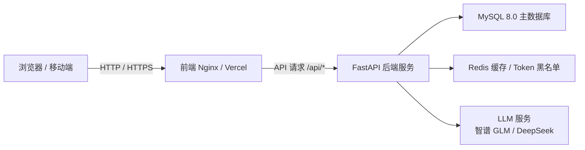
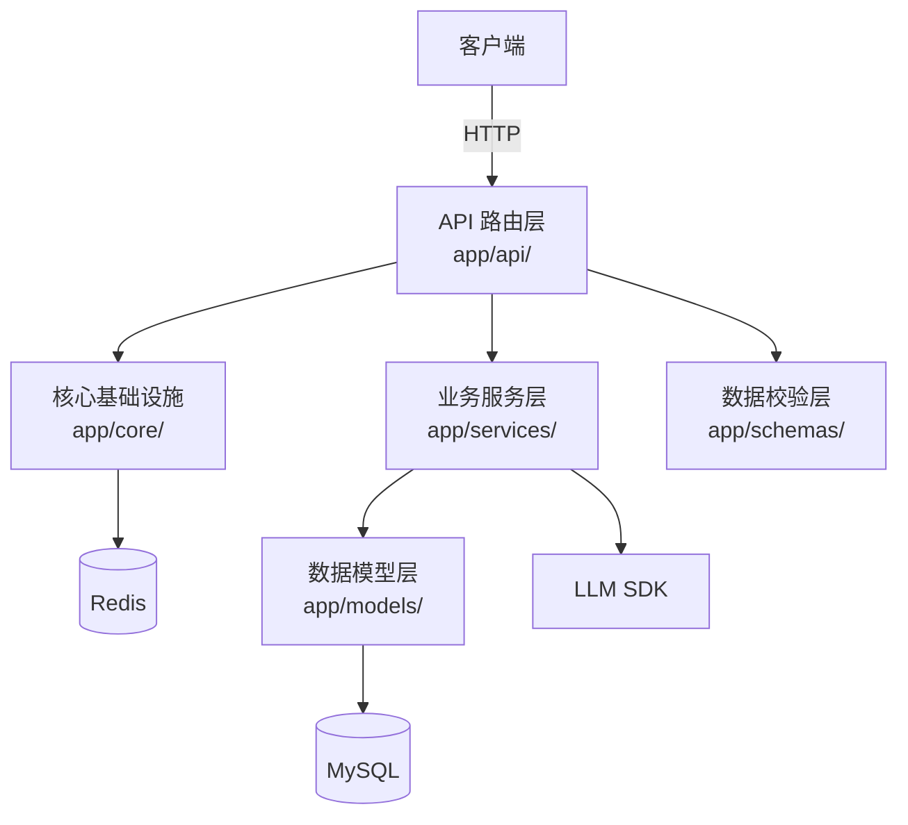
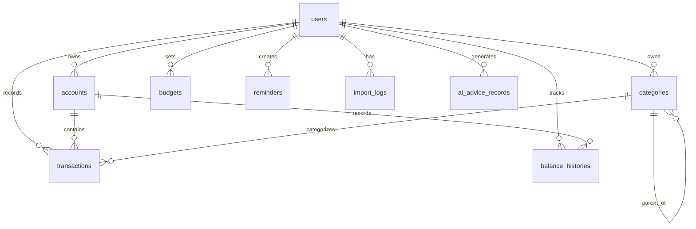
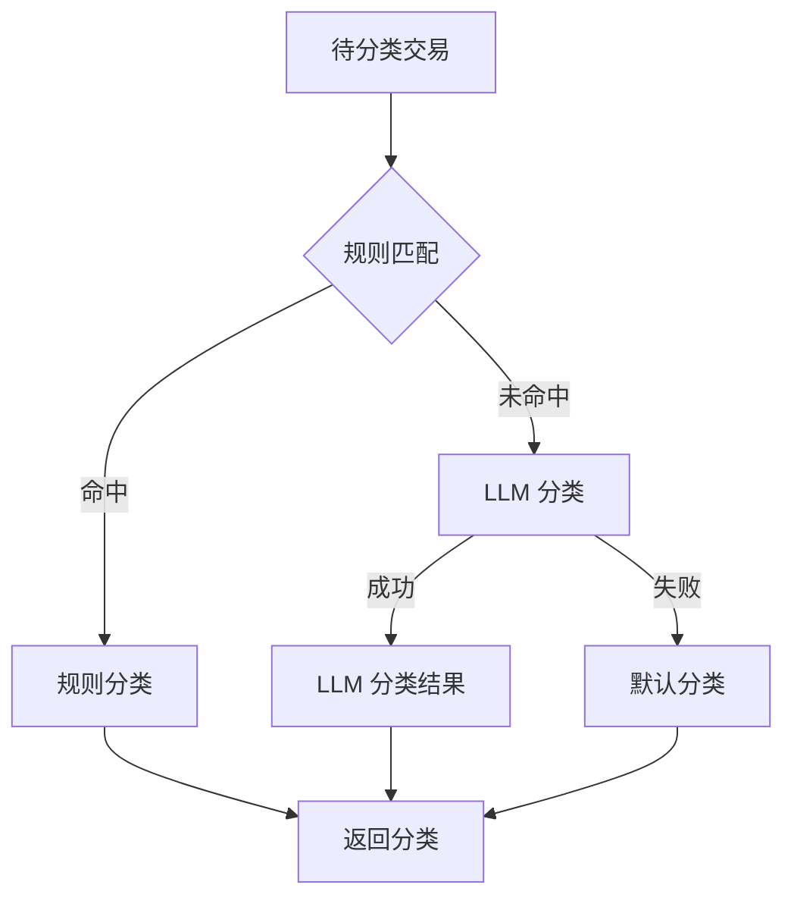

# 智能个人财务记账系统 —— 系统文档

**版本**：v1.0.0  
**最后更新**：2026-06-27  
**适用范围**：项目开发、维护、评审及后续迭代参考

---

## 目录

- [1. 项目概述](#1-项目概述)
- [2. 技术架构](#2-技术架构)
  - [2.1 架构总览](#21-架构总览)
  - [2.2 技术栈](#22-技术栈)
- [3. 功能模块](#3-功能模块)
  - [3.1 用户认证](#31-用户认证)
  - [3.2 账户管理](#32-账户管理)
  - [3.3 分类管理](#33-分类管理)
  - [3.4 交易记录](#34-交易记录)
  - [3.5 预算管理](#35-预算管理)
  - [3.6 统计分析](#36-统计分析)
  - [3.7 微信账单导入](#37-微信账单导入)
  - [3.8 AI 智能服务](#38-ai-智能服务)
  - [3.9 提醒管理](#39-提醒管理)
  - [3.10 分析报告](#310-分析报告)
- [4. 数据库设计](#4-数据库设计)
  - [4.1 实体关系图](#41-实体关系图)
  - [4.2 数据表清单](#42-数据表清单)
  - [4.3 核心表字段说明](#43-核心表字段说明)
- [5. 接口设计](#5-接口设计)
  - [5.1 统一响应格式](#51-统一响应格式)
  - [5.2 认证方式](#52-认证方式)
  - [5.3 接口概览](#53-接口概览)
- [6. AI 服务设计](#6-ai-服务设计)
  - [6.1 智能分类机制](#61-智能分类机制)
  - [6.2 理财建议生成](#62-理财建议生成)
  - [6.3 缓存与降级策略](#63-缓存与降级策略)
- [7. 安全设计](#7-安全设计)
- [8. 项目目录结构](#8-项目目录结构)
  - [8.1 后端目录结构](#81-后端目录结构)
  - [8.2 前端目录结构](#82-前端目录结构)
- [9. 部署与运维](#9-部署与运维)
  - [9.1 环境要求](#91-环境要求)
  - [9.2 本地开发启动](#92-本地开发启动)
  - [9.3 Docker Compose 部署](#93-docker-compose-部署)
  - [9.4 生产环境部署](#94-生产环境部署)
  - [9.5 健康检查与监控](#95-健康检查与监控)
- [10. 测试与 CI](#10-测试与-ci)
  - [10.1 测试框架](#101-测试框架)
  - [10.2 测试覆盖范围](#102-测试覆盖范围)
  - [10.3 持续集成](#103-持续集成)

---

## 1. 项目概述

智能个人财务记账系统是一款面向个人用户的财务管理应用，旨在帮助用户记录日常收支、管理多账户资产、制定并跟踪预算、导入微信账单、获取可视化统计报表以及 AI 驱动的理财建议。

### 核心特性

| 特性 | 说明 |
|------|------|
| **手动记账** | 支持收入、支出、转账三类交易，可关联账户与分类，填写备注、商户、交易时间等 |
| **微信账单导入** | 支持 CSV / XLSX 格式，自动解析表头，识别重复交易，AI 自动分类 |
| **多账户管理** | 支持现金、储蓄卡、信用卡、电子钱包等多种账户类型，支持余额调整与历史追踪 |
| **预算管理** | 支持月度 / 年度预算，按分类汇总进度，提供预警提示 |
| **统计可视化** | 提供收支概览、趋势分析、分类占比等图表，使用 ECharts 渲染 |
| **AI 理财建议** | 基于用户历史交易生成消费亮点、优化建议、风险提醒与下月预算建议 |
| **提醒管理** | 支持每日提醒、预算预警、定期记账、报告提醒 |
| **安全认证** | JWT Bearer 认证、密码 BCrypt 加密、Token 黑名单、IP 速率限制 |

### 目标用户

- 有个人记账需求的普通用户
- 需要管理多账户、多分类收支的用户
- 希望通过微信账单快速迁移历史数据的用户
- 希望获得数据化、智能化财务分析的用户

---

## 2. 技术架构

### 2.1 架构总览

系统采用前后端分离的 RESTful 架构：



后端内部分层如下：



### 2.2 技术栈

#### 前端技术栈

| 类别 | 技术/库 | 版本 | 用途 |
|------|---------|------|------|
| 核心框架 | Vue 3 | ^3.4.0 | 构建用户界面 |
| 构建工具 | Vite | ^5.0.0 | 快速冷启动与热更新 |
| 编程语言 | TypeScript | ~5.3.0 | 类型安全 |
| 路由管理 | Vue Router | ^4.2.0 | SPA 路由 |
| 状态管理 | Pinia | ^2.1.0 | 全局状态管理 |
| UI 组件库（桌面端） | Element Plus | ^2.4.0 | 桌面端 UI 组件 |
| UI 组件库（移动端） | Vant | ^4.8.0 | 移动端 UI 组件 |
| HTTP 客户端 | Axios | ^1.6.0 | API 请求 |
| 图表库 | ECharts | ^5.4.0 | 数据可视化 |
| 实用工具 | VueUse | ^10.7.0 | 组合式 API 工具 |
| 日期处理 | Day.js | ^1.11.0 | 日期时间处理 |

#### 后端技术栈

| 类别 | 技术/库 | 版本 | 用途 |
|------|---------|------|------|
| Web 框架 | FastAPI | ≥ 0.110 | HTTP 路由、依赖注入、自动文档 |
| ORM | SQLAlchemy | ≥ 2.0 | 数据库映射与查询 |
| 数据库迁移 | Alembic | ≥ 1.13 | 数据库版本管理 |
| 数据验证 | Pydantic v2 | ≥ 2.6 | 请求/响应 Schema |
| 关系型数据库 | MySQL | 8.0 | 主数据存储 |
| 缓存 / Token | Redis | 7.x | JWT 黑名单、统计缓存 |
| 认证 | python-jose + passlib | — | JWT 与密码哈希 |
| Excel 导出 | openpyxl | ≥ 3.1 | 报表生成 |
| AI 大模型 | OpenAI SDK 兼容接口 | — | 智能分类与理财建议 |
| 环境配置 | python-dotenv | — | 读取 `.env` |
| 测试 | pytest + httpx | — | 接口测试 |
| 服务器 | Uvicorn | — | ASGI 服务器 |

---

## 3. 功能模块

### 3.1 用户认证

用户认证模块提供完整的注册、登录、Token 管理及密码重置能力。

| 功能 | 说明 |
|------|------|
| 注册 | 校验用户名唯一性，使用 BCrypt 加密密码 |
| 登录 | 校验用户名密码，签发 Access Token 与 Refresh Token |
| Token 刷新 | 使用 Refresh Token 换取新的 Access Token |
| 登出 | 将当前 Access Token 加入内存黑名单 |
| 当前用户信息 | 获取 / 更新当前登录用户资料 |
| 修改密码 | 验证旧密码后更新为新密码 |
| 密码重置 | 请求重置链接，使用一次性 Token 重置密码 |

认证路由统一以 `/api/auth` 为前缀，例如：

- `POST /api/auth/register`
- `POST /api/auth/login`
- `POST /api/auth/logout`
- `POST /api/auth/refresh`
- `GET /api/auth/me`
- `POST /api/auth/password-reset-request`

### 3.2 账户管理

账户模块支持用户维护多个资金账户，记录余额变动。

| 功能 | 说明 |
|------|------|
| 账户 CRUD | 创建、查询、更新、删除账户 |
| 账户类型 | 现金、储蓄卡、信用卡、电子钱包、投资、其他 |
| 默认账户 | 设置默认账户，用于导入时自动选择 |
| 账户汇总 | 统计总资产、总负债、净资产 |
| 账户转账 | 在同一用户的两个账户之间进行资金划转 |
| 余额调整 | 直接调整账户余额并记录调整历史 |
| 余额历史 | 按账户查询余额变化趋势 |

关键文件：`backend/app/api/accounts.py`

### 3.3 分类管理

分类用于对交易进行归类，支持系统预设分类与用户自定义分类。

| 功能 | 说明 |
|------|------|
| 系统分类初始化 | 用户注册时自动创建餐饮、交通、购物、医疗等默认分类 |
| 自定义分类 | 用户可新增、修改、删除自己的分类 |
| 分类类型 | 收入 / 支出，分别管理 |
| 树形结构 | 支持父分类与子分类，便于多级管理 |
| 分类统计 | 按分类汇总收支金额与占比 |

关键文件：`backend/app/api/categories.py`、`backend/app/services/category_service.py`

### 3.4 交易记录

交易是系统的核心数据，支持收入、支出、转账三种类型。

| 功能 | 说明 |
|------|------|
| 交易 CRUD | 创建、查询、更新、删除交易 |
| 交易类型 | income（收入）、expense（支出）、transfer（转账） |
| 关联信息 | 关联账户、分类、商户、备注、交易时间 |
| 余额联动 | 创建 / 更新 / 删除交易时自动更新相关账户余额 |
| 搜索筛选 | 按时间范围、类型、分类、账户、关键词搜索 |
| 分页展示 | 支持 page / page_size 分页，默认 20 条 |
| 重复标记 | 支持将交易标记为重复，便于后续去重分析 |
| 微信导入关联 | 支持 `wechat_transaction_id` 字段，避免重复导入 |

关键文件：`backend/app/api/transactions.py`、`backend/app/models/transaction.py`

### 3.5 预算管理

预算模块帮助用户设定周期性的支出上限并跟踪执行进度。

| 功能 | 说明 |
|------|------|
| 预算 CRUD | 创建、查询、更新、删除预算 |
| 预算周期 | 支持 monthly（月度）、yearly（年度） |
| 预算对象 | 可针对总支出或特定分类设定预算 |
| 进度计算 | 根据实际支出自动计算已用百分比 |
| 预警提示 | 当支出接近或超过预算时返回预警状态 |

关键文件：`backend/app/api/budgets.py`

### 3.6 统计分析

统计模块为前端仪表盘与报表页面提供数据支撑。

| 功能 | 说明 |
|------|------|
| 收支概览 | 统计指定时间范围内的总收入、总支出、结余 |
| 趋势分析 | 按日 / 周 / 月 / 年聚合收支趋势 |
| 分类占比 | 按一级分类统计支出或收入占比 |
| Excel 导出 | 导出交易明细或统计报表为 Excel 文件 |

关键文件：`backend/app/api/statistics.py`、`backend/app/api/reports.py`

### 3.7 微信账单导入

微信账单导入模块支持用户上传 CSV 或 XLSX 格式的微信账单，自动解析并生成交易记录。

| 功能 | 说明 |
|------|------|
| 文件格式支持 | CSV、XLSX，最大 10MB |
| 自动编码识别 | 使用 chardet 自动识别 CSV 编码 |
| 表头自动识别 | 自动查找包含“交易时间”、“交易类型”、“金额”等关键字段的表头行 |
| 预览功能 | 返回前 10 条或全部解析结果供用户确认 |
| 格式验证 | 校验文件扩展名、大小、表头完整性 |
| 重复检测 | 根据时间、金额、描述检测潜在重复交易 |
| 自动分类 | 导入后调用 AI 服务自动分类 |
| 导入日志 | 记录每次导入的成功、失败、跳过条数及错误详情 |

关键文件：`backend/app/api/wechat_bill.py`、`backend/app/services/wechat_bill_service.py`

### 3.8 AI 智能服务

AI 服务是系统的智能化核心，提供交易分类与理财建议能力。

| 功能 | 说明 |
|------|------|
| 智能分类 | 对单条或多条交易进行规则 + LLM 分类 |
| 重新分类 | 对已有交易重新调用 AI 分类 |
| 理财建议 | 基于近 N 个月交易生成消费亮点、优化建议、风险提醒、下月预算 |
| 建议历史 | 保存并查看历史生成的理财建议 |
| 用量统计 | 统计 LLM 调用次数与 Token 消耗 |

关键文件：`backend/app/api/ai.py`、`backend/app/services/ai_service.py`

### 3.9 提醒管理

提醒模块用于向用户发送预算预警、账单到期等通知。

| 功能 | 说明 |
|------|------|
| 提醒 CRUD | 创建、查询、更新、删除提醒 |
| 提醒类型 | daily（每日提醒）、budget（预算预警）、recurring（定期记账）、report（报告提醒） |
| 今日提醒 | 查询当天需要触发的提醒列表 |
| 启用 / 禁用 | 支持开关提醒，无需删除 |

关键文件：`backend/app/api/reminders.py`

### 3.10 分析报告

分析报告模块生成周期性总结与分类深度分析。

| 功能 | 说明 |
|------|------|
| 月度报告 | 汇总指定月份的收支、预算执行、Top 分类 |
| 年度报告 | 汇总指定年份的年度财务情况 |
| 分类分析 | 针对特定分类进行趋势与占比分析 |

关键文件：`backend/app/api/reports.py`

---

## 4. 数据库设计

### 4.1 实体关系图



### 4.2 数据表清单

| 表名 | 说明 |
|------|------|
| `users` | 用户基础信息 |
| `categories` | 收入 / 支出分类，支持树形结构 |
| `accounts` | 用户资金账户 |
| `transactions` | 交易记录 |
| `budgets` | 预算设置 |
| `reminders` | 提醒事项 |
| `import_logs` | 微信账单导入日志 |
| `ai_advice_records` | AI 理财建议历史 |
| `balance_histories` | 账户余额历史 |

### 4.3 核心表字段说明

#### users（用户表）

| 字段 | 类型 | 说明 |
|------|------|------|
| `id` | INT | 主键，自增 |
| `username` | VARCHAR(50) | 用户名，唯一 |
| `email` | VARCHAR(100) | 邮箱，唯一 |
| `password_hash` | VARCHAR(255) | BCrypt 加密后的密码 |
| `avatar` | VARCHAR(255) | 头像 URL |
| `is_active` | BOOLEAN | 是否激活 |
| `created_at` | DATETIME | 创建时间 |
| `updated_at` | DATETIME | 更新时间 |

#### categories（分类表）

| 字段 | 类型 | 说明 |
|------|------|------|
| `id` | INT | 主键，自增 |
| `user_id` | INT | 所属用户，外键；系统分类可为空 |
| `name` | VARCHAR(50) | 分类名称 |
| `type` | VARCHAR(20) | income / expense |
| `icon` | VARCHAR(10) | 图标 |
| `color` | VARCHAR(7) | 颜色 |
| `parent_id` | INT | 父分类 ID，外键 |
| `sort_order` | INT | 排序序号 |
| `is_system` | BOOLEAN | 是否系统预设 |
| `created_at` | DATETIME | 创建时间 |
| `updated_at` | DATETIME | 更新时间 |

#### accounts（账户表）

| 字段 | 类型 | 说明 |
|------|------|------|
| `id` | INT | 主键，自增 |
| `user_id` | INT | 所属用户，外键 |
| `name` | VARCHAR(50) | 账户名称 |
| `type` | VARCHAR(20) | 账户类型 |
| `balance` | DECIMAL(15,2) | 当前余额 |
| `initial_balance` | DECIMAL(15,2) | 初始余额 |
| `icon` | VARCHAR(10) | 图标 |
| `color` | VARCHAR(7) | 颜色 |
| `is_default` | BOOLEAN | 是否默认账户 |
| `is_enabled` | BOOLEAN | 是否启用 |
| `description` | TEXT | 账户描述 |
| `created_at` | DATETIME | 创建时间 |
| `updated_at` | DATETIME | 更新时间 |

#### transactions（交易表）

| 字段 | 类型 | 说明 |
|------|------|------|
| `id` | INT | 主键，自增 |
| `user_id` | INT | 所属用户，外键 |
| `type` | VARCHAR(20) | income / expense / transfer |
| `amount` | DECIMAL(15,2) | 金额 |
| `category_id` | INT | 关联分类，外键 |
| `account_id` | INT | 关联账户，外键 |
| `to_account_id` | INT | 转入账户 ID，外键；转账时使用 |
| `transaction_date` | DATETIME | 交易时间 |
| `remark` | VARCHAR(255) | 备注 |
| `merchant_name` | VARCHAR(100) | 商户名称 |
| `product_name` | VARCHAR(255) | 商品名称 |
| `source` | VARCHAR(20) | 来源：manual / wechat |
| `wechat_transaction_id` | VARCHAR(64) | 微信交易流水号 |
| `tags` | JSON | 标签列表 |
| `location` | VARCHAR(255) | 地理位置 |
| `images` | JSON | 图片 URL 列表 |
| `ai_classified` | BOOLEAN | 是否由 AI 分类 |
| `is_repeated` | BOOLEAN | 是否标记为重复 |
| `created_at` | DATETIME | 创建时间 |
| `updated_at` | DATETIME | 更新时间 |

唯一约束：`(user_id, account_id, wechat_transaction_id)`，防止同一微信交易重复导入。

#### budgets（预算表）

| 字段 | 类型 | 说明 |
|------|------|------|
| `id` | INT | 主键，自增 |
| `user_id` | INT | 所属用户，外键 |
| `category_id` | INT | 关联分类，外键；为空表示总预算 |
| `amount` | DECIMAL(15,2) | 预算金额 |
| `period_type` | VARCHAR(20) | monthly / yearly |
| `year` | INT | 预算年份 |
| `month` | INT | 预算月份；年度预算可为空 |
| `alert_threshold` | INT | 预警阈值百分比，默认 80 |
| `is_enabled` | BOOLEAN | 是否启用 |
| `created_at` | DATETIME | 创建时间 |
| `updated_at` | DATETIME | 更新时间 |

#### import_logs（导入日志表）

| 字段 | 类型 | 说明 |
|------|------|------|
| `id` | INT | 主键，自增 |
| `user_id` | INT | 所属用户 ID（逻辑关联，无外键约束） |
| `source` | VARCHAR(50) | 导入来源，默认 wechat |
| `file_name` | VARCHAR(200) | 文件名 |
| `file_size` | INT | 文件大小（字节） |
| `status` | VARCHAR(20) | pending / processing / completed / failed / partial |
| `total_records` | INT | 总记录数 |
| `success_records` | INT | 成功记录数 |
| `failed_records` | INT | 失败记录数 |
| `skipped_records` | INT | 跳过记录数（重复） |
| `error_details` | JSON | 错误详情 |
| `import_summary` | TEXT | 导入摘要 |
| `created_at` | DATETIME | 创建时间 |
| `updated_at` | DATETIME | 更新时间 |

#### reminders（提醒表）

| 字段 | 类型 | 说明 |
|------|------|------|
| `id` | INT | 主键，自增 |
| `user_id` | INT | 所属用户，外键 |
| `type` | VARCHAR(20) | daily / budget / recurring / report |
| `title` | VARCHAR(100) | 提醒标题 |
| `content` | VARCHAR(500) | 提醒内容 |
| `remind_time` | TIME | 提醒时间 |
| `remind_day` | INT | 提醒日期（1-31） |
| `category_id` | INT | 关联分类，外键 |
| `amount` | DECIMAL(15,2) | 金额阈值 |
| `is_enabled` | BOOLEAN | 是否启用 |
| `last_reminded_at` | DATETIME | 上次提醒时间 |
| `created_at` | DATETIME | 创建时间 |
| `updated_at` | DATETIME | 更新时间 |

#### ai_advice_records（AI 建议记录表）

| 字段 | 类型 | 说明 |
|------|------|------|
| `id` | INT | 主键，自增 |
| `user_id` | INT | 所属用户，外键 |
| `advice_type` | VARCHAR(20) | 建议类型，默认 financial |
| `analysis_period_start` | DATETIME | 分析周期开始 |
| `analysis_period_end` | DATETIME | 分析周期结束 |
| `highlights` | JSON | 消费亮点 |
| `warnings` | JSON | 风险提醒 |
| `suggestions` | JSON | 优化建议 |
| `budget_suggestion` | JSON | 下月预算建议 |
| `full_report` | TEXT | 完整分析报告 |
| `tokens_used` | INT | 消耗 Token 数 |
| `from_cache` | BOOLEAN | 是否来自缓存 |
| `created_at` | DATETIME | 创建时间 |
| `updated_at` | DATETIME | 更新时间 |

#### balance_histories（余额历史表）

| 字段 | 类型 | 说明 |
|------|------|------|
| `id` | INT | 主键，自增 |
| `account_id` | INT | 关联账户，外键 |
| `transaction_id` | INT | 关联交易，外键 |
| `change_type` | VARCHAR(20) | income / expense / transfer / adjust |
| `amount_before` | DECIMAL(15,2) | 变化前余额 |
| `amount_after` | DECIMAL(15,2) | 变化后余额 |
| `change_amount` | DECIMAL(15,2) | 变化金额 |
| `description` | VARCHAR(255) | 描述 |
| `created_at` | DATETIME | 创建时间 |
| `updated_at` | DATETIME | 更新时间 |

---

## 5. 接口设计

### 5.1 统一响应格式

所有 API 接口统一返回以下 JSON 结构：

```json
{
  "code": 200,
  "message": "success",
  "data": {}
}
```

- `code`：业务状态码，200 表示成功，其他值表示具体错误
- `message`：提示信息
- `data`：实际业务数据

### 5.2 认证方式

系统使用 JWT Bearer Token 认证：

- 登录成功后返回 `access_token` 与 `refresh_token`
- 受保护接口需要在请求头中携带：`Authorization: Bearer <access_token>`
- Access Token 默认有效期 30 分钟
- Refresh Token 默认有效期 7 天
- 登出时当前 Access Token 加入内存黑名单，立即失效

### 5.3 接口概览

| 模块 | 路径前缀 | 主要接口 | 说明 |
|------|----------|----------|------|
| 健康检查 | `/api/health` | `GET /api/health` | 服务健康状态 |
| 指标监控 | `/api/metrics` | `GET /api/metrics` | 请求指标暴露 |
| 认证 | `/api/auth` | `POST /register`、`POST /login`、`POST /logout`、`POST /refresh`、`GET /me`、`PUT /me`、`POST /change-password`、`POST /password-reset-request`、`POST /password-reset` | 用户认证与资料 |
| 分类 | `/api/categories` | `POST /init-system`、`GET /`、`GET /tree`、`GET /stats`、`GET /{id}`、`POST /`、`PUT /{id}`、`DELETE /{id}` | 分类管理 |
| 账户 | `/api/accounts` | `GET /`、`GET /summary`、`GET /default`、`GET /{id}`、`POST /`、`PUT /{id}`、`DELETE /{id}`、`POST /transfer`、`POST /{id}/adjust-balance`、`GET /{id}/balance-history` | 账户管理 |
| 交易 | `/api/transactions` | `GET /`、`POST /`、`PUT /{id}`、`DELETE /{id}`、`GET /summary`、`POST /search`、`POST /{id}/mark-repeated` | 交易管理 |
| 预算 | `/api/budgets` | `GET /`、`POST /`、`PUT /{id}`、`DELETE /{id}` | 预算管理 |
| 统计 | `/api/statistics` | `GET /overview`、`GET /trend`、`GET /category`、`GET /export/excel` | 统计分析 |
| 提醒 | `/api/reminders` | `GET /`、`GET /statistics`、`GET /check-today`、`GET /{id}`、`POST /`、`PUT /{id}`、`PATCH /{id}/toggle`、`DELETE /{id}` | 提醒管理 |
| 报告 | `/api/reports` | `GET /monthly`、`GET /yearly`、`GET /category/{id}`、`POST /monthly-auto-report` | 分析报告（动态查询，无独立报告表） |
| 余额历史 | `/api/balance-history` | `GET /`（支持 `limit`、`offset`、`change_type` 查询参数） | 账户余额历史 |
| 微信账单 | `/api/wechat` | `POST /preview`、`POST /import`、`POST /import-base64`、`POST /validate`、`GET /import-logs`、`GET /import-logs/{id}`、`GET /import-logs/{id}/errors` | 微信账单导入 |
| AI | `/api/ai` | `POST /classify`、`POST /reclassify/{id}`、`POST /advice`、`GET /advice/history`、`GET /usage` | AI 服务 |

FastAPI 自动生成的交互式 API 文档可在运行后访问：

- Swagger UI：`http://localhost:8000/docs`
- ReDoc：`http://localhost:8000/redoc`

---

## 6. AI 服务设计

### 6.1 智能分类机制

AI 分类采用分级策略，优先使用低成本、高确定性的方式，最后才调用 LLM：



> **注**：在 `/api/ai/classify` 与重新分类接口中采用“规则优先、LLM 兜底”策略；而微信账单导入的自动分类为了提高准确性，采用“LLM 优先 → 规则兜底 → 默认分类保底”策略。

#### 规则匹配

系统内置常用商户关键词规则，例如：

| 分类 | 关键词示例 |
|------|------------|
| 餐饮 | 餐厅、外卖、咖啡、奶茶、麦当劳、肯德基 |
| 交通 | 滴滴、出租、地铁、公交、加油、停车 |
| 购物 | 京东、淘宝、天猫、超市、便利店 |
| 医疗 | 医院、药店、诊所 |
| 娱乐 | 电影、游戏、KTV、会员 |

#### LLM 分类

当规则无法命中时，调用 OpenAI SDK 兼容的 LLM（如智谱 GLM / DeepSeek），输入商户名、商品说明、金额、交易类型，返回 JSON 格式的分类结果：

```json
{
  "results": [
    {
      "index": 0,
      "category_id": 1,
      "category_name": "餐饮",
      "confidence": 0.95
    }
  ]
}
```

LLM 调用失败时，自动降级到当前用户的默认分类（通常是“其他”）。

### 6.2 理财建议生成

理财建议基于用户近 N 个月（默认 3 个月）的交易数据生成，流程如下：

1. 检查缓存：若近期已生成过相同周期的建议，直接返回缓存结果
2. 查询交易数据并按分类、时间聚合
3. 调用 LLM 生成建议，包含：
   - 消费亮点
   - 优化建议
   - 风险提醒
   - 下月预算建议
   - 完整分析报告
4. 保存到 `ai_advice_history` 表
5. 返回结果并标注 `from_cache`

### 6.3 缓存与降级策略

| 策略 | 说明 |
|------|------|
| 规则优先 | 优先使用本地规则匹配，减少 LLM Token 消耗 |
| 建议缓存 | 相同周期、相同用户的请求优先返回缓存，避免重复调用 |
| LLM 失败降级 | LLM 不可用时返回默认分类或默认建议，保证核心功能可用 |
| 用量统计 | 记录 LLM 调用次数、成功次数、Token 消耗，便于成本监控 |

---

## 7. 安全设计

系统从认证、传输、访问控制、数据隔离等多个层面保障安全：

| 安全措施 | 说明 |
|----------|------|
| **密码加密** | 使用 passlib + BCrypt 对密码进行哈希存储，禁止明文保存 |
| **JWT 认证** | 使用 python-jose 签发与校验 JWT，Access Token 30 分钟、Refresh Token 7 天 |
| **Token 黑名单** | 登出时将 Access Token 加入内存黑名单，立即失效 |
| **速率限制** | 基于 IP 的滑动窗口限流，对登录、注册、密码重置等接口设置严格阈值 |
| **安全响应头** | 通过中间件添加 `X-Content-Type-Options`、`X-Frame-Options` 等响应头 |
| **数据隔离** | 所有查询默认携带 `user_id` 过滤，防止横向越权 |
| **SQL 注入防护** | 使用 SQLAlchemy ORM 参数化查询，禁止拼接 SQL |
| **输入校验** | 使用 Pydantic v2 对所有请求参数进行严格校验 |
| **CORS 控制** | 可通过配置限制跨域来源；开发环境当前允许所有来源 |

---

## 8. 项目目录结构

### 8.1 后端目录结构

```
backend/
├── main.py                        # FastAPI 应用入口
├── .env                           # 环境变量配置
├── .env.example                   # 环境变量模板
├── pyproject.toml                 # uv 项目配置
├── uv.lock                        # 依赖锁定文件
├── alembic.ini                    # Alembic 迁移配置
├── alembic/                       # 数据库迁移脚本
│   ├── env.py
│   └── versions/
└── app/
    ├── config/                    # 配置层
    │   ├── settings.py            # 全局配置
    │   ├── database.py            # 数据库引擎与 Session
    │   └── redis.py               # Redis 连接
    ├── api/                       # 路由层
    │   ├── __init__.py            # 路由器注册
    │   ├── health.py              # 健康检查
    │   ├── metrics.py             # 运行指标
    │   ├── auth.py                # 认证
    │   ├── accounts.py            # 账户
    │   ├── categories.py          # 分类
    │   ├── transactions.py        # 交易
    │   ├── budgets.py             # 预算
    │   ├── statistics.py          # 统计
    │   ├── reports.py             # 报告（动态查询）
    │   ├── reminders.py           # 提醒
    │   ├── balance_history.py     # 余额历史
    │   ├── wechat_bill.py         # 微信账单
    │   └── ai.py                  # AI 服务
    ├── models/                    # ORM 模型层
    │   ├── user.py
    │   ├── account.py
    │   ├── category.py
    │   ├── transaction.py
    │   ├── budget.py
    │   ├── reminder.py
    │   ├── import_log.py
    │   ├── ai_advice_record.py
    │   ├── balance_history.py
    │   └── __init__.py
    ├── schemas/                   # Pydantic 校验层
    │   ├── common.py              # 统一响应包装
    │   ├── user.py
    │   ├── account.py
    │   ├── category.py
    │   ├── transaction.py
    │   ├── budget.py
    │   ├── statistics.py
    │   ├── reminder.py
    │   ├── balance_history.py
    │   ├── wechat_bill.py
    │   └── ai.py
    ├── services/                  # 业务服务层
    │   ├── ai_service.py          # AI 分类与建议
    │   ├── category_service.py    # 默认分类初始化
    │   └── wechat_bill_service.py # 微信账单解析
    ├── core/                      # 核心基础设施
    │   ├── security.py            # JWT 与密码哈希
    │   ├── dependencies.py        # FastAPI 依赖
    │   ├── exceptions.py          # 全局异常处理
    │   ├── rate_limiter.py        # 速率限制
    │   └── metrics.py             # 指标收集
    └── utils/                     # 工具函数
        └── logger.py              # 结构化日志配置
```

### 8.2 前端目录结构

```
frontend/
├── index.html                   # 应用入口 HTML
├── package.json                 # 项目依赖
├── tsconfig.json                # TypeScript 配置
├── vite.config.ts               # Vite 配置
├── public/                      # 静态资源
└── src/
    ├── main.ts                  # 应用入口
    ├── App.vue                  # 根组件
    ├── env.d.ts                 # 类型声明
    ├── api/                     # API 接口封装
    │   ├── index.ts             # API 统一导出
    │   ├── request.ts           # Axios 封装
    │   ├── auth.ts
    │   ├── accounts.ts
    │   ├── budgets.ts
    │   ├── transactions.ts
    │   ├── categories.ts
    │   ├── statistics.ts
    │   ├── reminders.ts
    │   ├── reports.ts
    │   ├── wechat.ts
    │   └── ai.ts
    ├── components/              # 公共组件
    │   ├── common/              # 通用组件
    │   ├── business/            # 业务组件
    │   └── layout/              # 布局组件
    ├── layouts/                 # 页面布局（如 MainLayout）
    ├── router/                  # 路由配置
    │   └── index.ts
    ├── stores/                  # Pinia 状态管理
    │   ├── index.ts             # Store 统一导出
    │   ├── app.ts               # 应用全局状态
    │   ├── user.ts              # 用户状态
    │   ├── category.ts          # 分类状态
    │   └── ai.ts                # AI 分析状态
    ├── utils/                   # 工具函数
    │   ├── format.ts            # 金额/文本格式化
    │   ├── date.ts              # 日期处理
    │   ├── constants.ts         # 常量定义
    │   ├── storage.ts           # 本地存储封装
    │   ├── validator.ts         # 表单校验
    │   ├── auth.ts              # 认证相关工具
    │   └── category.ts          # 分类相关工具
    ├── views/                   # 页面视图
    │   ├── auth/                # 登录/注册
    │   ├── dashboard/           # 仪表盘
    │   ├── transaction/         # 交易列表/详情
    │   ├── account/             # 账户管理
    │   ├── budget/              # 预算管理
    │   ├── statistics/          # 统计报表
    │   ├── import/              # 账单导入
    │   ├── ai/                  # AI 分析
    │   └── settings/            # 设置
    └── styles/                  # 全局样式
```

---

## 9. 部署与运维

### 9.1 环境要求

| 环境 | 要求 |
|------|------|
| Python | ≥ 3.10 |
| Node.js | ≥ 18 |
| MySQL | 8.0 |
| Redis | 7.x |
| 包管理 | 后端使用 uv，前端使用 npm / pnpm |

### 9.2 本地开发启动

#### 后端

```bash
cd backend
uv venv
source .venv/bin/activate  # Windows: .venv\Scripts\activate
uv sync
uv run uvicorn main:app --reload --host 0.0.0.0 --port 8000
```

#### 前端

```bash
cd frontend
npm install
npm run dev
```

### 9.3 Docker Compose 部署

项目支持通过 Docker Compose 一键启动完整环境，包含后端、前端、MySQL、Redis：

```bash
docker-compose up --build
```

服务启动后：

- 前端：`http://localhost:5173`
- 后端 API：`http://localhost:8000`
- API 文档：`http://localhost:8000/docs`

### 9.4 生产环境部署

#### Railway（推荐）

后端、MySQL、Redis 统一部署在 Railway 平台，通过环境变量注入配置：

- `DATABASE_URL`
- `REDIS_URL`
- `SECRET_KEY`
- `AI_API_KEY`
- `AI_BASE_URL`
- `AI_MODEL`

#### Vercel

前端静态站点部署在 Vercel，构建命令：

```bash
npm run build
```

输出目录：`frontend/dist`

### 9.5 健康检查与监控

| 端点 | 路径 | 说明 |
|------|------|------|
| 健康检查 | `GET /api/health` | 返回服务状态、数据库连接状态 |
| 指标监控 | `GET /api/metrics` | 返回请求计数、响应时间等运行指标 |

---

## 10. 测试与 CI

### 10.1 测试框架

#### 后端测试

- **框架**：pytest + FastAPI TestClient
- **数据库**：测试使用 SQLite 内存数据库，避免污染开发数据库
- **Mock**：对 LLM 调用、外部 API、数据库查询进行 Mock 隔离

运行后端测试：

```bash
cd backend
uv run pytest tests/ -v
```

#### 前端测试

- **框架**：Vitest + Vue Test Utils
- **范围**：组件渲染、Props、事件、Store 交互

运行前端测试：

```bash
cd frontend
npm run test
```

### 10.2 测试覆盖范围

| 类型 | 覆盖内容 |
|------|----------|
| 单元测试 | 密码哈希、JWT 签发与校验、AI 规则匹配、LLM Mock 分类 |
| 接口测试 | 认证、交易、账户、预算、统计、微信导入、AI 接口 |
| 组件测试 | 登录页、仪表盘、交易卡片、AI 分析页等 |

### 10.3 持续集成

项目使用 GitHub Actions 实现持续集成，工作流包含：

- 代码风格检查（后端 ruff、前端 ESLint）
- 后端 pytest 测试并生成覆盖率报告
- 前端 Vitest 测试并生成覆盖率报告
- 覆盖率上传至 Codecov

CI 配置文件：`.github/workflows/ci.yml`

---

## 附录：常用命令速查

| 命令 | 说明 |
|------|------|
| `uv sync` | 安装后端依赖 |
| `uv run uvicorn main:app --reload` | 启动后端开发服务器 |
| `uv run pytest tests/ -v` | 运行后端测试 |
| `npm install` | 安装前端依赖 |
| `npm run dev` | 启动前端开发服务器 |
| `npm run test` | 运行前端测试 |
| `npm run build` | 构建前端生产包 |
| `docker-compose up --build` | Docker 完整启动 |

---

*本文档基于项目当前真实代码编写，后续如发生架构或接口变更，应及时同步更新本文件。*
